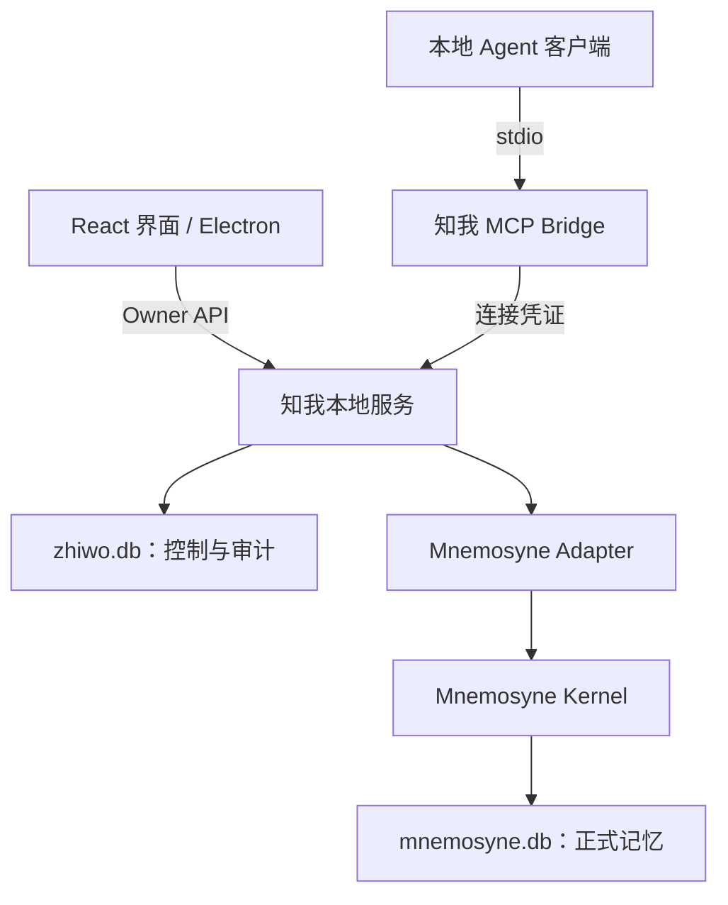

# 知我 · ARCHITECTURE

> V1.0 启动基线｜2026-09-25  
> 范围以 [PRODUCT.md](PRODUCT.md) 为准。以下是知我的设计契约；底层实际接口、版本及平台兼容性在 [PLAN.md](PLAN.md) 的 P0 验证。

## 1. 架构决策

| 层 | 首版选择 | 边界 |
| --- | --- | --- |
| 界面 | React + TypeScript + Vite；Tailwind CSS | P1 先跑本地 Web，P3 复用同一界面装入 Electron |
| 桌面壳 | Electron，Windows 原生环境优先 | 管理窗口、受限文件操作和本地服务生命周期 |
| 本地服务 | Python + FastAPI，单进程服务 | 审核、发布、权限、画像、导出；模块化单体 |
| MCP | Python MCP SDK，stdio bridge | 客户端只连接知我 Gateway，不连接原生 Kernel MCP |
| 正式记忆 | `mnemosyne-oss/mnemosyne`，经 Adapter 调用 | 复用内核；不复制第二套长期记忆引擎 |
| 业务数据 | SQLite `zhiwo.db` | 来源、提案、权限、映射及访问记录 |
| 模型 | 可配置的兼容 API 提取器；检索向量化默认本地 | 不固定未经验证的模型版本；画像首版不依赖 LLM |
| 开发工具 | pnpm 管理前端，uv 管理 Python；pytest + 必要的 UI 验证 | P0 确定运行时版本并提交锁文件；不要求 Docker / WSL |

这些是启动选择，尚未跑通。**不能用上游 README 的能力描述代替本项目验收。**

## 2. 运行结构

同一用户只有一个知我服务负责写入两个数据库。MCP bridge 是轻量进程，不另开记忆库，也不直接读文件。UI、Gateway 通过同一服务执行规则。

服务只监听 `127.0.0.1`；Owner 与 Agent 使用不同凭证和路由。Electron 关闭 Node 集成、启用 context isolation；preload 仅暴露所需调用。渲染层无数据库、任意文件系统或任意命令执行权限。

运行数据统一位于 `ZHIWO_DATA_DIR`：发布版由 Electron 的用户数据目录派生；开发/测试显式使用隔离目录。包含 `zhiwo.db`、Kernel 专用目录、模型缓存。禁止误用用户已有的 Mnemosyne 默认库。

## 3. 两个数据库如何分工

**`mnemosyne.db` 回答“已经确认记住了什么”；`zhiwo.db` 回答“从哪来、谁批准、谁能取、曾返回什么”。**

| 数据 | 权威存储 | 规则 |
| --- | --- | --- |
| 正式记忆正文、各版本、检索索引 | Mnemosyne | 正文不在业务库另建可检索镜像 |
| 来源原文、待审核或被拒绝的提案 | `zhiwo.db` | 不进入 Kernel，不参与正式检索或画像 |
| 记忆 ID 映射、类别、共享/发布状态、有效期、来源指针 | `zhiwo.db` | 产品控制元数据；对外可见性由服务统一判定 |
| Agent、工具与类别权限、撤销状态 | `zhiwo.db` | 拒绝优先；调用方不得自报身份 |
| 返回内容及版本的访问快照 | `zhiwo.db` | 只为审计；不得回流成正式记忆或参与检索 |
| 关于我画像 | 运行时派生，必要时可丢弃缓存 | 从当前有效个人事实构建；修改回到正式记忆流程 |

来源与审计可能包含和正式记忆相同的文字，但不是第二份可修改的事实库。删除时也要清理相关内容副本。

### 3.1 业务库最小逻辑模型

具体 DDL 在实现中迁移管理；不得把下表当作 Mnemosyne 的真实表结构。

| 表 | 核心字段 / 用途 |
| --- | --- |
| `sources` | `id, kind, name, content, content_hash, imported_at`；`kind=manual/paste/file/agent_claim` |
| `import_jobs` | `id, source_id, status, extractor_config, error_code`；提取状态与重试，不存密钥 |
| `proposals` | `id, origin, change_type, target_id, base_revision, payload_json, evidence_json, status, decision, operation_id` |
| `memory_refs` | `memory_id, revision, kernel_id, kind, category, scope, lifecycle, share_enabled, valid_until, source_refs, approved_evidence, operation_id`；每版本一行，无正式正文 |
| `agents` | `id, name, credential_hash, enabled, policy_version`；凭证可重置 |
| `agent_permissions` | `agent_id, allowed_tools, allowed_categories`；空集即无权限 |
| `access_events` | `request_id, agent_id, tool, outcome, policy_version, response_snapshot, created_at, delivery_state` |
| `operations` | `id, action, target_id, base_revision, status, error_code`；跨库写入恢复及幂等 |
| `settings` | 非敏感设置、schema 版本、选定模型；密钥使用系统凭据存储或开发环境变量 |

统一外部 `memory_id` 为知我生成的稳定 UUID；`revision` 从 1 递增；Kernel ID 只在 Adapter 内解释。类别冻结为 `identity/goal/preference/project/event/other`，每条一个类别；`scope` 表示适用场景，不是权限类别。

`lifecycle=active/superseded/deleting`；每条记忆最多一个当前版本，过期由 `valid_until` 与当前时间判定。正文、类别或适用场景修改生成新版本；共享开关是业务控制元数据，可在业务库中更新，无需复制正文。

业务上的 `kind=fact/event` 对应个人事实/事件。产品方案里的 Canonical Facts、Episodic 是语义分类，**不假设上游有同名表或完全等价的公开接口**。Working Memory 不作为未审核内容的暂存区。P0 核对映射、持久性与自动整理策略。

## 4. 模块接口

以下均为知我内部契约，不是宣称 Mnemosyne 已实现的方法。模型对象在 `contracts/` 定义，HTTP/OpenAPI 与 MCP schema 复用。

| 模块 | 输入 → 输出 | 责任 |
| --- | --- | --- |
| SourceImport | `import_text(text, kind, request_id)` → `ImportJob`；`extract(job_id)` → `Proposal[]` | 校验、存来源、调用用户选定提取器、产出候选；无 Kernel 写权 |
| ProposalReview | `decide(id, decision, edited_payload?, base_revision?)` → `Operation` | 新增/更新/保留两者/拒绝；核验来源与目标版本 |
| MemoryService | `create/update/delete/set_sharing` → `Operation / Memory` | Owner 的正式写入、生命周期、冲突处理、操作恢复 |
| ProfileBuilder | `build_profile()` → 按主题分组的 `ProfileCard[]` | 只读已发布、当前有效事实；每句附记忆 ID 与版本 |
| PolicyEngine | `authorize(principal, tool)`；`filter(principal, memories, now)` | 身份、工具、类别、发布状态、共享开关、有效期统一判断 |
| AccessLedger | `append(request_id, sanitized_response)` → `event_id` | 记录本次确定要返回的内容；日志写失败则不发出记忆内容 |
| MnemosyneAdapter | `put_version/get_version/search/list_versions/delete_all_versions/find_operation` | 隔离上游接口、版本定位、存取、删除、幂等查证；不解释用户授权 |

正式写入最小载荷：`{content, kind, category, scope?, valid_until?, share_enabled, source_refs}`。提案更新额外要求 `target_id, base_revision`。所有写入带幂等 `request_id`；同一 ID、不同载荷返回冲突。

Profile 首版用模板组合已确认内容，不从原文再次推断。事件只用于“近期变化”，不自动晋升为稳定事实。停止共享的记忆仍可出现在本人画像中。

## 5. 审核、版本与跨库一致性

提案状态：`pending → publishing → accepted`；拒绝为 `rejected`；发布失败为 `failed`，允许按同一操作重试。更新前比较 `base_revision`；冲突返回 `CONFLICT`，不自动覆盖。手动保存走相同发布机制，但不创建待审核提案。

两个 SQLite 库之间不假定原子事务。首版用**单服务写锁 + 持久操作记录 + 发布可见性检查**：

1. 在 `zhiwo.db` 校验当前版本、记录用户决定和 `operation_id`，状态设为准备发布。
2. Adapter 写入带 `operation_id` 的新版本。已有当前版本此时不失效；新版本尚未对产品或 Agent 可见。
3. 核验 Kernel 写入后，在业务库一次事务登记新版本为当前、旧版本为历史，并将操作及提案标为完成。
4. 所有读取只接纳 `memory_refs` 中已提交发布的精确版本。Kernel 返回的未知、暂存或自动派生条目一律丢弃。

如果 Kernel 写成功而业务提交失败，重启后按 `operation_id` 查证并补完，不盲目再次写入。恢复前受影响的新版本保持不可见。若上游不能可靠定位写入结果、隔离自动合并或保存历史，P0 判阻塞，不另造第二个事实库补洞。

删除先在业务库标记不可见，再逐项清理 Kernel 版本、索引和业务内容副本；未完成时为“删除处理中”，重启继续。不能仅删 `memory_refs` 就声称永久删除成功。

## 6. Owner API 与 MCP 契约

### 6.1 本机 Owner API

前缀 `/api/v1`，仅本机 Owner 凭证可调用；Agent 凭证不能调用这些接口。

| 路由 | 用途 |
| --- | --- |
| `GET /health`；`GET /profile` | 运行状态；画像 |
| `POST /imports`；`GET /imports/{id}`；`POST /imports/{id}/retry` | 提取任务及失败重试 |
| `GET /proposals`；`POST /proposals/{id}/decision` | 候选与审核，批量审核可逐项调用并汇总结果 |
| `GET/POST /memories`；`GET/PATCH/DELETE /memories/{id}` | 查询、添加、修改、永久删除 |
| `GET /memories/{id}/versions` | 历史版本 |
| `GET/POST /agents`；`PATCH /agents/{id}`；`POST /agents/{id}/rotate-credential` | 连接、权限、启停、凭证重置 |
| `GET /access-events`；`GET /access-events/{id}` | 请求列表与返回快照 |
| `GET/PATCH /settings`；`POST /settings/test-model` | 非敏感设置及模型连通测试，响应不回显密钥 |
| `POST /exports`；`POST /backups`；`POST /restores`；`POST /data/reset` | 导出、备份、恢复、清空；破坏性操作必须带确认 |

写操作携带 `Idempotency-Key`；异步工作返回 `operation_id`，通过 `GET /operations/{id}` 查看最终状态。`PATCH /memories/{id}` 必须带 `base_revision`。

### 6.2 MCP：只暴露四个工具

| 工具 | 参数 | 返回 |
| --- | --- | --- |
| `get_context` | `task: string, max_items?: 1..10`，默认 5 | 与任务相关且获准的 `MemoryItem[]` |
| `search_memory` | `query: string, categories?: Category[], limit?: 1..20`，默认 10 | 同一权限规则下的 `MemoryItem[]` |
| `propose_memory` | `request_id: UUID, change: {type: add/update, content, kind, category, scope?, target_id?, base_revision?}, evidence: {text, source_ref?}` | `proposal_id, status: pending`；同 ID 重试返回原提案 |
| `explain_memory` | `id: string` | 当前获准版本的出处类型、确认时间及用户审核过的证据片段 |

`MemoryItem = {id, revision, content, kind, category, scope?, valid_until?}`。成功响应包含 `request_id, items/result, truncated`；失败包含 `request_id, error: {code, message, retryable}`，不附带未授权内容。

`get_context` 只组装获准记忆，不调用模型再总结；不接受完整画像请求绕过类别过滤。`explain_memory` 不返回整份原文、旧版本或其他记忆；无权访问与不存在统一返回 `NOT_FOUND`，避免通过 ID 探测信息。Agent 只可在其获准类别提交提案；更新目标还需当前可访问。

错误码至少覆盖：`UNAUTHENTICATED`、`FORBIDDEN`、`NOT_FOUND`、`VALIDATION_ERROR`、`CONFLICT`、`MODEL_UNAVAILABLE`、`KERNEL_UNAVAILABLE`、`AUDIT_UNAVAILABLE`。未返回记忆是正常空结果，不触发全库兜底。

### 6.3 身份与最小披露

每条连接由 Owner 创建随机专用凭证，数据库只存凭证哈希；stdio 启动配置通过环境变量交给 bridge。服务根据凭证解析 `agent_id`，忽略客户端自报名称作为身份的做法。Owner 凭证不得出现在 Agent 配置中。

完整读取路径：鉴权 → 检查工具 → 检索 → 逐条检查精确版本、类别、共享、有效期 → 限量并构造响应 → 再检查权限版本 → 写返回快照 → 发出。权限变更与响应提交在单服务内串行化；撤销完成后提交的新响应不能使用旧权限。

提交响应的锁内还要重新检查每条记忆的共享、有效期与当前版本，覆盖检索期间发生的变化。检索支持时先限定范围，否则分批补取再过滤，不能因第一批都是无权结果就返回全库兜底。正式条目正文最多 2000 字符；上下文/搜索累计返回正文最多 8000 字符，按完整条目限量并设置 `truncated`，不拼接半条事实。

过滤必须发生在内容交给外部 Agent 或云模型之前。不能先把全库交给 LLM 再让它删掉无权信息。日志记录最终序列化的返回载荷，连同 `prepared/sent/failed` 交付状态；崩溃时允许标为“交付未知”，不得声称对方已收到或采用。

空结果和拒绝也记录 `outcome`，不写未授权正文。`sent` 仅表示交给发送通道；不等于模型已收到。默认不保存完整任务/查询文本，避免访问日志额外积累无关个人信息。

禁止暴露原生删除/覆盖工具，以及绕过过滤的 MCP resources/prompts。这里控制的是接入配置的权限，不承诺抵御拥有同一系统用户文件权限的恶意进程，也不提供不可伪造的客户端品牌认证。

## 7. 删除、导出与恢复

- 永久删除：清除对应所有版本、向量/全文索引、相关提案正文、批准片段、画像缓存、访问快照中的该记忆内容。审计可保留“已删除”的无正文标记。
- 来源仍含待删内容时，删除预览列出关联来源；V1 整份删除这些来源，并清理来源提案。其他正式记忆可保留，但显示“来源已删除”。不尝试自动精准擦除共享原文的若干句。
- 可读导出：JSON + Markdown，包含正式记忆、版本与可用来源关联，不含凭证或 API Key。导出已删除内容属于缺陷。
- 备份：暂停写入和提取作业，完成/恢复未决操作后，使用 SQLite 一致性备份能力获取两个库及必要 Kernel 文件，附清单与版本。不能只复制一个正在写入的 `.db` 文件而忽略 WAL。
- 恢复：V1 仅恢复同应用/schema/Kernel 版本备份；在隔离目录校验后替换，失败保留原库。恢复后全部 Agent 停用并使旧凭证失效；模型密钥需重新配置，避免复活旧权限。
- 清空数据：停止服务写入，清理两个库和应用管理的内容副本，重建空库。用户另存的历史备份和已发给外部 Agent 的内容不能随之清除。

所有成功状态须以实际存取结果为依据；“删除”指应用与数据库逻辑清除，不承诺存储介质取证级擦除。

## 8. 目录与实现约束

| 目录 | 内容 |
| --- | --- |
| 根目录四份 `.md` | 唯一常驻项目文档，不额外维护另一套 PRD/架构/进度 |
| `apps/web/` | 四页界面、设置、公共组件、API client |
| `apps/desktop/` | Electron main/preload、打包与服务启动 |
| `server/zhiwo/api/`、`gateway/` | Owner HTTP API、MCP bridge 与 Agent 入口 |
| `server/zhiwo/services/`、`adapters/` | 产品逻辑、Mnemosyne 和提取模型适配 |
| `server/zhiwo/repositories/`、`contracts/` | 业务库访问/迁移、共享数据结构 |
| `experiments/kernel_spike/` | P0 可复现验证脚本与结果 |
| `tests/`、`fixtures/` | 关键边界测试、固定合成中文样本 |

运行数据库、个人原文、API Key、访问快照、备份不提交 Git。上游仅在 Adapter 中引用；不直接更改其 schema 或源码。没有实际需要时不增加消息队列、独立向量库、第二套后端或微服务。

## 9. P0 待验证与参考依据

以下未验证项必须填写实测证据后才能转为确认：精确依赖版本、Windows 原生安装、中文本地模型、正式记忆持久性、版本/删除接口、自动整理禁用或隔离、幂等写入定位、一个真实客户端的 stdio 通信。未通过时保持 P0 阻塞，按 [AGENTS.md](AGENTS.md) 提交决策选项。

官方资料核对于 2026-09-25，仅用于确认集成方向：

- [Mnemosyne 仓库与 Python/MCP 接口说明](https://github.com/mnemosyne-oss/mnemosyne)：支持 SQLite 本地记忆和 SDK/MCP 接入；具体调用固定到 P0 选定版本。
- [Mnemosyne 配置说明](https://github.com/mnemosyne-oss/mnemosyne/blob/main/docs/configuration.md)：区分本地与远程向量化；P0 使用明确配置，避免环境变量继承导致意外联网。
- [MCP 本地连接说明](https://modelcontextprotocol.io/docs/develop/connect-local-servers)：stdio 作为本地接入方式；知我的身份、权限和审核由自身服务实现。

正文定义的 Adapter 与工具是知我拟实现的接口，不复制或承诺上游全部能力。
