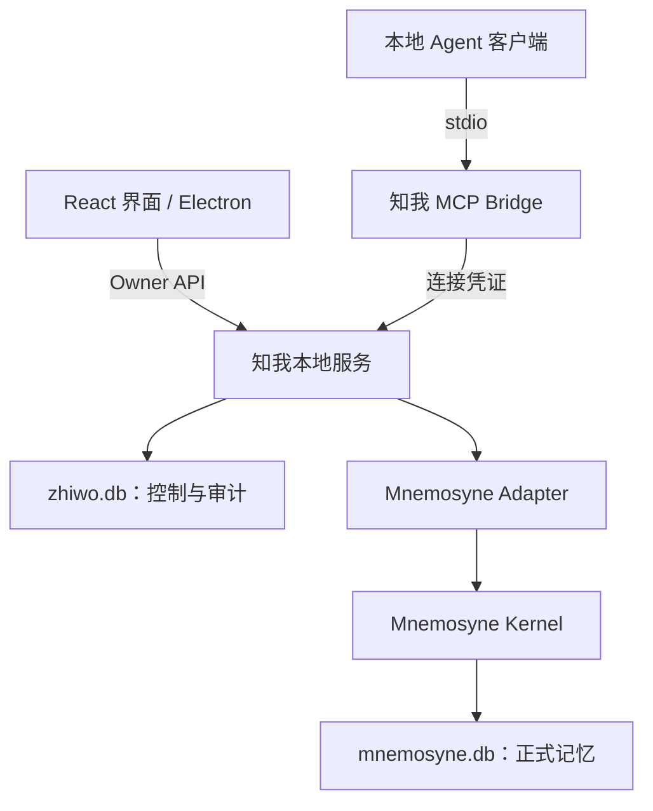

# 知我 · ARCHITECTURE

> V1.0 启动基线｜2026-09-26  
> 范围以 [PRODUCT.md](PRODUCT.md) 为准。以下是知我的设计契约；底层实际接口、版本及平台兼容性在 [PLAN.md](PLAN.md) 的 P0 验证。

## 1. 架构决策

| 层 | 首版选择 | 边界 |
| --- | --- | --- |
| 界面 | React + TypeScript + Vite；Tailwind CSS；`@base-ui/react` 提供无样式的可访问控件，`motion` 只做反馈动效，`recharts` 2.15.4 只画关于我的读取次数折线 | P1 先跑本地 Web，P3 复用同一界面装入 Electron |
| 桌面壳 | Electron，Windows 原生环境优先 | 管理窗口、受限文件操作和本地服务生命周期 |
| 本地服务 | Python + FastAPI，单进程服务 | 审核、发布、权限、画像、导出；模块化单体 |
| MCP | Python MCP SDK，stdio bridge | 客户端只连接知我 Gateway，不连接原生 Kernel MCP |
| 正式记忆 | `mnemosyne-oss/mnemosyne`，经 Adapter 调用 | 复用内核；不复制第二套长期记忆引擎 |
| 业务数据 | SQLite `zhiwo.db` | 来源、提案、权限、映射及访问记录 |
| 模型 | 可配置的兼容 API 提取器；检索向量化默认本地 | 不固定未经验证的模型版本；画像卡片不依赖 LLM，AI 摘要只在 Owner 手动触发时调用同一模型配置 |
| 开发工具 | pnpm 管理前端，uv 管理 Python；pytest + 必要的 UI 验证 | P0 确定运行时版本并提交锁文件；不要求 Docker / WSL |

这些是启动选择，尚未跑通。**不能用上游 README 的能力描述代替本项目验收。**

## 2. 运行结构

同一用户只有一个知我服务负责写入两个数据库。MCP bridge 是轻量进程，不另开记忆库，也不直接读文件。UI、Gateway 通过同一服务执行规则。

服务只监听 `127.0.0.1`；Owner 与 Agent 使用不同凭证和路由。Electron 关闭 Node 集成、启用 context isolation；preload 仅暴露所需调用。渲染层无数据库、任意文件系统或任意命令执行权限。

运行数据统一位于 `ZHIWO_DATA_DIR`：发布版由 Electron 的用户数据目录派生；开发/测试显式使用隔离目录。包含 `zhiwo.db`、Kernel 专用目录、模型缓存。禁止误用用户已有的 Mnemosyne 默认库。

发布版的页面由本地服务在 `127.0.0.1:8765` 同源提供构建好的前端，Electron 窗口直接打开这个地址。Owner 凭证由 main 进程首次启动时生成并保存在数据目录，经 preload 交给渲染层。关闭窗口只隐藏到托盘，服务继续运行；托盘退出时结束服务进程树。随包模型只带 `models--Qdrant--bge-small-zh-v1.5`，通过 `ZHIWO_FASTEMBED_CACHE_DIR` 只读使用。

## 3. 两个数据库如何分工

**`mnemosyne.db` 回答“已经确认记住了什么”；`zhiwo.db` 回答“从哪来、谁批准、谁能取、曾返回什么”。**

| 数据 | 权威存储 | 规则 |
| --- | --- | --- |
| 正式记忆正文、各版本、检索索引 | Mnemosyne | 正文不在业务库另建可检索镜像 |
| 来源原文、待审核或被拒绝的提案 | `zhiwo.db` | 不进入 Kernel，不参与正式检索或画像 |
| 记忆 ID 映射、类别、共享/发布状态、有效期、来源指针 | `zhiwo.db` | 产品控制元数据；对外可见性由服务统一判定 |
| Agent、工具与类别权限、撤销状态 | `zhiwo.db` | 拒绝优先；调用方不得自报身份 |
| 返回内容及版本的访问快照 | `zhiwo.db` | 只为审计；不得回流成正式记忆或参与检索 |
| 关于我画像与 AI 摘要 | 卡片运行时派生；摘要在 `zhiwo.db` 保存一条可丢弃缓存 | 都从当前有效个人事实构建；摘要不参与检索、不反向生成正式记忆，修改回到正式记忆流程 |

来源与审计可能包含和正式记忆相同的文字，但不是第二份可修改的事实库。删除时也要清理相关内容副本。

### 3.1 业务库最小逻辑模型

具体 DDL 在实现中迁移管理；不得把下表当作 Mnemosyne 的真实表结构。

| 表 | 核心字段 / 用途 |
| --- | --- |
| `sources` | `id, kind, name, content, content_hash, imported_at`；`kind=manual/paste/file/agent_claim` |
| `import_jobs` | `id, source_id, status, extractor_config, error_code`；提取状态与重试，不存密钥 |
| `proposals` | `id, origin, change_type, target_id, base_revision, payload_json, evidence_json, status, decision, operation_id, intent_json, agent_id, client_request_id`；`intent_json` 保存已提交的审核意图，包含共享状态、有效期，以及这两个字段是否出现在请求里。Agent 提案的幂等键是 `agent_id + client_request_id`，不跨连接共用 |
| `memory_refs` | `memory_id, revision, kernel_id, kind, category, scope, lifecycle, share_enabled, valid_until, source_refs, approved_evidence, operation_id`；每版本一行，无正式正文。所有者列表另附 `origin`，由该版本的来源和提案上的 `agent_id` 推出，不另存一列。`GET /api/v1/memories` 的 `origin` 按这个来源筛选，取值是已知客户端 id，或 `agent:` 加自定义连接名称 |
| `agents` | `id, name, credential_hash, enabled, policy_version, client_status, created_at, updated_at`；`credential_hash` 是 sha256，明文不入库。凭证可重置。`client_status` 新建为 `pending`，只有 stdio 通道成功交付一次工具响应后才变为 `verified`。已停用的连接不会被标成已连接。迁移版本是 6 |
| `agent_permissions` | `agent_id, allowed_tools, allowed_categories`；空集即无权限 |
| `agent_commands` | `id, agent_id, action, payload_hash, created_at`；管理请求的幂等记录。不存凭证明文，不存记忆正文 |
| `access_events` | `id, request_id, agent_id, tool, outcome, policy_version, response_snapshot, created_at, delivery_state`；`id` 由服务生成，每次调用或重试各有一行。`outcome` 是 `success`、`empty` 或 `rejected`。`response_snapshot` 就是那一次返回的业务载荷。`delivery_state` 从 `prepared` 只能变为 `sent`、`failed` 或 `unknown`，之后不再改。交付按 `id` 更新，不按请求号批量更新 |
| `profile_summary` | 单行派生缓存：`text, input_hash, generated_at, model, memory_count`。不保存原始记忆集合，不参与普通检索；可随时删除并从 Mnemosyne 当前记忆重建 |
| `operations` | `id, action, target_id, base_revision, revision, payload_hash, payload_json, kernel_id, status, error_code`；跨库写入恢复及幂等。`payload_json` 只用于核对和恢复，不作为正式检索正文 |
| `settings` | 非敏感设置、schema 版本、选定模型；密钥使用系统凭据存储或开发环境变量 |

统一外部 `memory_id` 为知我生成的稳定 UUID；`revision` 从 1 递增；Kernel ID 只在 Adapter 内解释。类别冻结为 `identity/goal/preference/project/event/other`，每条一个类别；`scope` 表示适用场景，不是权限类别。

`lifecycle=active/superseded/deleting`；每条记忆最多一个当前版本，过期由 `valid_until` 与当前时间判定。正文、类别或适用场景修改生成新版本；共享开关是业务控制元数据，可在业务库中更新，无需复制正文。

业务上的 `kind=fact/event` 对应个人事实/事件。产品方案里的 Canonical Facts、Episodic 是语义分类，**不假设上游有同名表或完全等价的公开接口**。Working Memory 不作为未审核内容的暂存区。P0 核对映射、持久性与自动整理策略。

## 4. 模块接口

以下均为知我内部契约，不是宣称 Mnemosyne 已实现的方法。模型对象在 `contracts/` 定义，HTTP/OpenAPI 与 MCP schema 复用。

| 模块 | 输入 → 输出 | 责任 |
| --- | --- | --- |
| SourceImport | `import_text(text, kind, request_id)` → `ImportJob`；`extract(job_id)` → `Proposal[]` | 校验、存来源、调用用户选定提取器、产出候选；无 Kernel 写权 |
| ProposalReview | `decide(id, decision, edited_payload?, base_revision?)` → `Operation` | 新增/更新/保留两者/拒绝；核验来源与目标版本 |
| MemoryService | `create/update/delete/set_sharing` → `Operation / Memory` | Owner 的正式写入、生命周期、冲突处理、操作恢复 |
| ProfileBuilder | `build_profile()` → 按主题分组的 `ProfileCard[]` | 只读已发布、当前有效事实；每句附记忆 ID 与版本 |
| ProfileSummary | `generate_profile_summary()` → `ProfileSummary` | Owner 手动触发；完整读取当前有效记忆，调用已配置模型，生成期间输入指纹变化则拒绝覆盖旧缓存 |
| PolicyEngine | `authorize(principal, tool)`；`filter(principal, memories, now)` | 身份、工具、类别、发布状态、共享开关、有效期统一判断 |
| AccessLedger | `append(request_id, sanitized_response)` → `event_id` | 记录本次确定要返回的内容；日志写失败则不发出记忆内容 |
| MnemosyneAdapter | `put_version/get_version/search/list_versions/delete_all_versions/find_operation` | 隔离上游接口、版本定位、存取、删除、幂等查证；不解释用户授权 |

正式写入最小载荷：`{content, kind, category, scope?, valid_until?, share_enabled, source_refs}`。提案更新额外要求 `target_id, base_revision`。所有写入带幂等 `request_id`；同一 ID、不同载荷返回冲突。

Profile 卡片用模板组合已确认内容，不从原文再次推断。事件不进入身份、目标、偏好、项目四类卡片，接口仍在 `recent` 里最多返回 8 条；关于我页面不再单独展示近期变化。事件不自动晋升为稳定事实。停止共享的记忆仍可出现在本人画像中。AI 摘要是额外一层 Owner 派生视图：每次重新读取全部当前有效记忆，把上一版摘要作为非事实参考后生成完整新摘要。输入按 ID、版本、类别、场景、共享、有效期和正文计算指纹；记忆变化后标为待更新，模型调用期间发生变化则不保存。输入过大时明确失败，不静默截断。永久删除清空缓存，生成失败保留旧缓存。摘要不进入 MCP 或其他 Agent 读取路径。

## 5. 审核、版本与跨库一致性

提案状态：`pending → publishing → accepted`；拒绝为 `rejected`；发布失败为 `failed`，允许按同一操作重试。更新前比较 `base_revision`；冲突返回 `CONFLICT`，不自动覆盖。手动保存和直接编辑已确认记忆都走相同发布机制，但不创建待审核提案。直接编辑是 `PATCH /api/v1/memories/{id}`，载荷含 `source_refs` 与 `base_revision`。导入失败时 `import_jobs.error_code` 区分 `TIMEOUT` 与 `VALIDATION_ERROR`，来源保留，可以重试。

两个 SQLite 库之间不假定原子事务。首版用**单服务写锁 + 持久操作记录 + 发布可见性检查**：

1. 在 `zhiwo.db` 校验当前版本、记录用户决定和 `operation_id`，状态设为准备发布。
2. Adapter 写入带 `operation_id` 的新版本。已有当前版本此时不失效；新版本尚未对产品或 Agent 可见。
3. 核验 Kernel 写入后，在业务库一次事务登记新版本为当前、旧版本为历史，并将操作及提案标为完成。
4. 所有读取只接纳 `memory_refs` 中已提交发布的精确版本。Kernel 返回的未知、暂存或自动派生条目一律丢弃。

如果 Kernel 写成功而业务提交失败，重启后按 `operation_id` 查证并补完，不盲目再次写入。恢复前受影响的新版本保持不可见。若上游不能可靠定位写入结果、隔离自动合并或保存历史，P0 判阻塞，不另造第二个事实库补洞。

P1.2 的正式新增只经过 `services/publish.py` 的 `publish_memory()`。它先写操作记录，再写 Kernel；本地向量和正文都核对之后，才在同一事务里登记唯一的 `active` 版本。导入与提取不调用这个入口。`ZHIWO_KERNEL_CONNECT_ONLY=1` 只用于不加载向量的连接测试。

更新或带目标记忆的编辑，缺省的共享状态和有效期继承当前版本。请求里没有这两个字段，与明确提交不同；候选里的默认值不能把未共享的记忆打开。明确传入 `share_enabled` 必须是布尔值，明确传入空的 `valid_until` 才清除有效期。新增、两者保留，以及不指向已有记忆的编辑，仍按候选和现有新增规则处理。

P1.3 的审核也只调用这个入口。`POST /api/v1/proposals/{id}/decision` 的决定是 `accept`、`update`、`keep_both`、`edit`、`reject`。拒绝不写 Kernel。更新另写一条 Kernel 记录，并在控制库的同一事务里把新版本标为当前、旧版本标为 `superseded`、提案标为 `accepted`。`base_revision` 与当前版本不一致时返回 `CONFLICT`，提案留在 `pending`。两者保留必须带 `scope`，并新建 `memory_id`。同一提案再次提交时比较已保存的审核意图：决定、编辑内容、场景、目标记忆、目标版本，以及共享状态、有效期和这两个字段是否被提交。意图相同则返回第一次的结果，即使 `Idempotency-Key` 不同；意图不同返回 `409 CONFLICT`，说明实际状态，正式记忆不变。缺省字段不会被请求模型写成明确清空。恢复时用操作记录里的原始载荷和版本 session 中已有的 Kernel 行补完控制库，不另建任务调度。故障注入只在 `ZHIWO_TEST_MODE=1` 且数据目录位于系统临时目录时生效。正式检索只认已提交的 `active` 版本。`GET /api/v1/memories/{id}/versions` 按控制库中的版本读取 Kernel 正文。`GET /api/v1/operations/{id}` 只返回操作状态。

删除先在业务库标记不可见，再逐项清理 Kernel 版本、索引和业务内容副本；未完成时为“删除处理中”，重启继续。不能仅删 `memory_refs` 就声称永久删除成功。

## 6. Owner API 与 MCP 契约

### 6.1 本机 Owner API

前缀 `/api/v1`，仅本机 Owner 凭证可调用；Agent 凭证不能调用这些接口。`GET /health` 在此前缀之外，只表示进程在运行。`GET /api/v1/health` 返回控制库版本、Kernel 连接、提取模型是否已配置、`test_mode`，以及 `mcp_runtime`。`test_mode` 只在 `ZHIWO_TEST_MODE=1` 时为真，页面用它标明演示数据。`mcp_runtime` 只包含本机 stdio bridge 的启动命令和当前服务地址；需要额外代码目录时才带 `PYTHONPATH`。不包含 Agent 凭证。该接口要求 Owner 凭证。

| 路由 | 用途 |
| --- | --- |
| `GET /health`；`GET /profile` | 运行状态；画像 |
| `GET /profile-summary`；`POST /profile-summary/generate` | 读取摘要缓存及新旧状态；Owner 主动调用模型重新生成 |
| `POST /imports`；`GET /imports/{id}`；`POST /imports/{id}/retry` | 提取任务及失败重试 |
| `GET /proposals`；`POST /proposals/{id}/decision` | 候选与审核。每条候选带 `requester`（提出它的客户端 id 和名称；导入的记为 OMNA）。决定仍逐项调用 |
| `GET/POST /memories`；`GET/PATCH/DELETE /memories/{id}`；`GET /memories/{id}/deletion-preview` | 查询、添加、修改、删除预览和永久删除。列表一次最多 50 条，按创建时间排序，`sort=newest\|oldest`。`cursor` 接上一页最后一条；响应带 `total` 和 `next_cursor`。没有正文关键词时只读取这一页的 Kernel 正文。当前记忆的搜索仍最多 20 条，并带 `truncated`，不使用 cursor |
| `GET /memories/{id}/versions` | 历史版本 |
| `GET /sources/{id}` | 已保存的来源原文；页面只按文本显示 |
| `GET/POST /agents`；`PATCH /agents/{id}`；`POST /agents/{id}/rotate-credential` | 连接、权限、启停、凭证重置。只允许 Owner。明文只在创建或重置的当次响应返回。每条连接附 `last_access_at`，取自 `access_events` 中该连接最新一条的时间，没有就是 `null`；Agent 侧接口不返回它 |
| `GET /agent-clients`；`POST /agent-clients/{id}/connect` | 固定名单：WorkBuddy、ZCode、OpenCode、ChatGPT、Claude、Claude Code。列表报告是否安装、配置文件里是否已有 `zhiwo`，以及 `agent_id`：设置 `client_agent:{id}` 指向、且仍存在的连接，没有就是 `null`。确认后合并写入该客户端自己的配置，响应不回显凭证 |
| `GET /access-events`；`GET /access-events/{id}` | 请求列表与返回快照。列表每条多一个 `returned`：从该次快照取出已返回的记忆正文或解释片段，压成单行，超过 160 字截断，最多 8 句。不另存一列。错误信息不算返回的句子。只出现在 Owner 的访问记录里 |
| `GET /access-reads?days=7\|14&utc_offset_minutes=` | 首页趋势图。按本地日汇总读取次数，并附带 `last_24h`：截至当前本地小时的 24 个小时。只计 `get_context`、`search_memory`、`explain_memory`。返回日期、小时和每个 Agent 的计数，不返回快照、正文或查询。`utc_offset_minutes` 与浏览器 `getTimezoneOffset()` 相同 |
| `GET/PATCH /settings`；`POST /settings/test-model`；`POST /settings/data-dir/open`；`POST /settings/data-dir/pick` | 非敏感设置及模型连通测试，响应不回显密钥。打开或选择文件夹只作用于本机资源管理器，不改 `ZHIWO_DATA_DIR` |
| `POST /exports`；`POST /backups`；`POST /restores?confirm=恢复备份`；`POST /data/reset` | 导出、备份、恢复、清空。恢复的确认词放在查询参数里，因为这四个字放不进 HTTP 头。清空的确认词在 JSON 里 |

写操作携带 `Idempotency-Key`；异步工作返回 `operation_id`，通过 `GET /operations/{id}` 查看最终状态。`PATCH /memories/{id}` 必须带 `base_revision`。

`GET /api/v1/agent/session` 不属于上表的 Owner 路由，也不是 MCP 工具。它只根据凭证返回连接身份、启用状态、`policy_version` 和已授权的工具、类别，不返回记忆。客户端另外提交的名称或 `agent_id` 不参与识别。

第一版客户端接入在 `services/client_connect.py`。名单是 WorkBuddy（`~/.workbuddy/mcp.json` 的 `mcpServers`）、ZCode（`~/.zcode/cli/config.json` 的 `mcp.servers`）、OpenCode（`~/.config/opencode/opencode.json` 的 `mcp`，`type: local`）、ChatGPT（桌面端、命令行和编辑器扩展共用 `~/.codex/config.toml` 的 `[mcp_servers.zhiwo]`）、Claude 桌面版（Windows 的 `%APPDATA%\Claude\claude_desktop_config.json` 的 `mcpServers`）和 Claude Code（`~/.claude.json` 用户级 `mcpServers`，`type: stdio`）。检测看这些目录、配置文件、同名命令、Windows 用户和系统 PATH 里的同名命令，以及用户目录下这些客户端的常见安装文件。Claude 桌面版另认当前用户已注册的应用包 `Claude_*pzs8sxrjxfjjc`。不扫描进程，不搜索整盘。写入是合并一条 `zhiwo`，不替换文件里的其他服务。启动命令默认是正在运行这份服务的 Python，参数是 `-m zhiwo.gateway.stdio_bridge`；从源码运行时带上 `server` 目录的 `PYTHONPATH`。安装进程用 `ZHIWO_BRIDGE_PYTHON` 指向随包解释器，解释器还不能导入 `zhiwo` 时再用 `ZHIWO_BRIDGE_PYTHONPATH` 指向随包代码目录。凭证只放进该文件的环境变量。已有连接在配置文件替换成功之后才保存新凭证；写入失败时旧凭证和旧权限保持不变。重新写入可以带上当前的工具和类别，避免先被预设覆盖。配置路径若经符号链接或目录联接跑到用户目录以外，拒绝写入。安装文件若经联接跑到用户目录以外，不把它算作已安装。`ZHIWO_CLIENT_HOME` 只在 `ZHIWO_TEST_MODE=1` 时改写目标目录。

P2.1 的权限变更在 `services/agents.py`。新连接的工具和类别为空，`policy_version` 从 1 开始。允许的工具是 `get_context`、`search_memory`、`propose_memory`、`explain_memory`；类别是 `identity`、`goal`、`preference`、`project`、`event`、`other`。未知值拒绝。`enabled`、工具、类别或凭证实际变化时 `policy_version` 加 1；只改名称不加。停用后的后续请求立即拒绝。重置使旧凭证立即失效，递增权限版本，并且不恢复已停用的连接。身份和权限用 `fetch_principal()` 一次连接查询读出。这个模块不读取、不写入记忆。

### 6.2 MCP：只暴露四个工具

| 工具 | 参数 | 返回 |
| --- | --- | --- |
| `get_context` | `task: string, max_items?: 1..10`，默认 5 | 与任务相关且获准的 `MemoryItem[]` |
| `search_memory` | `query: string, categories?: Category[], limit?: 1..20`，默认 10 | 同一权限规则下的 `MemoryItem[]` |
| `propose_memory` | `request_id: UUID, change: {type: add/update, content, kind, category, scope?, target_id?, base_revision?}, evidence: {text, source_ref?}` | `proposal_id, status: pending`；同 ID 重试返回原提案 |
| `explain_memory` | `id: string` | 当前获准版本的出处类型、确认时间及用户审核过的证据片段 |

`MemoryItem = {id, revision, content, kind, category, scope?, valid_until?}`。成功响应包含 `request_id, items/result, truncated`；失败包含 `request_id, error: {code, message, retryable}`，不附带未授权内容。

`get_context` 只组装获准记忆，不调用模型再总结；不接受完整画像请求绕过类别过滤。`explain_memory` 不返回整份原文、旧版本或其他记忆；无权访问与不存在统一返回 `NOT_FOUND`，避免通过 ID 探测信息。Agent 只可在其获准类别提交提案；更新目标还需当前可访问。

错误码至少覆盖：`UNAUTHENTICATED`、`FORBIDDEN`、`NOT_FOUND`、`VALIDATION_ERROR`、`CONFLICT`、`MODEL_UNAVAILABLE`、`KERNEL_UNAVAILABLE`、`AUDIT_UNAVAILABLE`。未返回记忆是正常空结果，不触发全库兜底。

### 6.3 身份与最小披露

每条连接由 Owner 创建随机专用凭证，数据库只存凭证哈希；stdio 启动配置通过环境变量交给 bridge。服务根据凭证解析 `agent_id`，忽略客户端自报名称作为身份的做法。Owner 凭证不得出现在 Agent 配置中。

P2.2 的四个工具在 `services/agent_tools.py`，可见性在 `services/policy.py`。缺少生命周期状态的行不可见。超过 2000 字的单条被跳过，后面的合格条目继续过滤。`server/zhiwo/mcp_bridge.py` 的 `forward()` 是本进程内的分发函数，只转发这四个名称，并拒绝未知工具和多余参数；它不做第二次过滤。独立 stdio 进程是 `zhiwo.gateway.stdio_bridge`。它携带 Agent 凭证，用 HTTP 调用现有服务，并带上 `X-Zhiwo-Transport: stdio`。它不打开数据库或 Kernel。协议库是 `mcp==2.2.0`，只负责 stdio 报文。

读取先确认连接启用且工具获准，再在锁外召回，最后进入 `commit_gate.commit_lock`。锁内先做最终检查、过滤并限量，把这一份载荷写入访问快照并提交。`record_prepared()` 返回服务生成的 `event_id`，经请求内的交付上下文交给发送方，不放进业务载荷。快照插入或这次提交失败时返回 `AUDIT_UNAVAILABLE`，不带记忆正文，也不留下半成品记录。HTTP 发送在 `api/channel.py`：交给通道之前，仍在同一把锁里按当前授权改写快照，使快照等于即将写出的字节；写出成功才把该 `event_id` 标为 `sent`。连接中断标 `failed`，结果无法判断标 `unknown`，这两种都不会标成 `sent`。这些状态都不表示模型已经阅读或采用。`propose_memory` 只写待确认提案，幂等范围是创建它的 Agent。`explain_memory` 只返回当前获准版本的来源类型、确认时间和已审核证据片段。

完整读取路径：鉴权 → 检查工具 → 检索 → 最终检查精确版本、类别、共享、有效期和权限版本 → 限量并冻结响应 → 写入并提交访问快照 → 交给发送通道前再核对一次 → 写出 HTTP 响应 → 按 `event_id` 记录交付。权限变更与这次提交、这次写出使用同一把锁。撤销若先完成，随后提交的响应不能包含已失去授权的内容。

提交响应的锁内还要重新检查每条记忆的共享、有效期与当前版本，覆盖检索期间发生的变化。检索支持时先限定范围，否则分批补取再过滤，不能因第一批都是无权结果就返回全库兜底。正式条目正文最多 2000 字符；上下文/搜索累计返回正文最多 8000 字符，按完整条目限量并设置 `truncated`，不拼接半条事实。

过滤必须发生在内容交给外部 Agent 或云模型之前。不能先把全库交给 LLM 再让它删掉无权信息。日志记录最终序列化的返回载荷，连同 `prepared/sent/failed` 交付状态；崩溃时允许标为“交付未知”，不得声称对方已收到或采用。

空结果和拒绝也记录 `outcome`，不写未授权正文。`sent` 仅表示交给发送通道；不等于模型已收到。默认不保存完整任务/查询文本，避免访问日志额外积累无关个人信息。

禁止暴露原生删除/覆盖工具，以及绕过过滤的 MCP resources/prompts。这里控制的是接入配置的权限，不承诺抵御拥有同一系统用户文件权限的恶意进程，也不提供不可伪造的客户端品牌认证。

## 7. 删除、导出与恢复

- 永久删除：清除对应所有版本、向量/全文索引、相关提案正文、批准片段、画像缓存、访问快照中的该记忆内容。审计可保留“已删除”的无正文标记。
- 来源仍含待删内容时，删除预览列出关联来源；V1 整份删除这些来源，并清理来源提案。其他正式记忆可保留，但显示“来源已删除”。不尝试自动精准擦除共享原文的若干句。
- 可读导出：JSON + Markdown，包含正式记忆、版本与可用来源关联，不含凭证或 API Key。导出已删除内容属于缺陷。
- 备份：暂停写入和提取作业，完成/恢复未决操作后，使用 SQLite 一致性备份能力获取两个库及必要 Kernel 文件，附清单与版本。不能只复制一个正在写入的 `.db` 文件而忽略 WAL。
- 恢复：V1 仅恢复同应用/schema/Kernel 版本备份；在隔离目录校验后替换，失败保留原库。恢复后全部 Agent 停用并使旧凭证失效；模型密钥需重新配置，避免复活旧权限。
- 清空数据：停止服务写入，清理两个库和应用管理的内容副本，重建空库。用户另存的历史备份和已发给外部 Agent 的内容不能随之清除。

所有成功状态须以实际存取结果为依据；“删除”指应用与数据库逻辑清除，不承诺存储介质取证级擦除。

P3.3 的实现：提取地址和模型名写在 `settings` 表。密钥用 Windows DPAPI 写到数据目录的 `extractor.key`，不进 `zhiwo.db`，接口也不回显。页面还没保存过时，进程继续使用启动时的环境变量。保存后当前进程立刻改用新配置。恢复会删掉这个密钥文件，并记 `extractor_requires_setup`，避免环境变量里的旧密钥自动生效；清空则去掉这个标记，重新读取环境变量。测试连接只发送一句不含记忆的请求。摘要缓存加入后 schema 是 7。永久删除先把版本标成 `deleting` 并写下操作，再清理 Kernel、派生行、摘要缓存和业务库里的正文；`ZHIWO_CRASH_AFTER=delete_marked` 只在测试模式且数据目录位于系统临时目录时，于标记之后退出。重启从 `prepared` 的删除操作继续。短生命周期的 Kernel 连接在用完后关闭，否则 Windows 会因文件占用而无法替换备份。

## 8. 目录与实现约束

| 目录 | 内容 |
| --- | --- |
| 根目录四份 `.md` | 唯一常驻项目文档，不额外维护另一套 PRD/架构/进度 |
| `apps/web/` | 四页界面、圆角顶栏、设置弹窗、客户端连接 UI、来源标志、`Skeleton` 加载占位、API client；品牌资源在 `brand/` 与 `apps/web/public/sources/` |
| `apps/desktop/` | Electron main/preload、打包与服务启动 |
| `server/zhiwo/api/`、`gateway/` | Owner HTTP API、MCP bridge 与 Agent 入口 |
| `server/zhiwo/services/`、`adapters/` | 产品逻辑、Mnemosyne 和提取模型适配 |
| `server/zhiwo/repositories/`、`contracts/` | 业务库访问/迁移、共享数据结构 |
| `experiments/kernel_spike/` | P0 可复现验证脚本与结果。正式服务不导入此目录，也不读取实验 `control.json` |
| `tests/`、`fixtures/` | 关键边界测试、固定合成中文样本 |

运行数据库、个人原文、API Key、访问快照、备份不提交 Git。上游仅在 Adapter 中引用；不直接更改其 schema 或源码。没有实际需要时不增加消息队列、独立向量库、第二套后端或微服务。

P1.1 的本机服务位于 `server/zhiwo/`。`zhiwo.db` 的 `memory_refs` 记录身份、版本和状态，不保存正式正文。`kind`、`category` 与适用场景 `scope` 是三个字段。Kernel 连接由 `adapters/kernel_client.py` 打开调用方指定的 `ZHIWO_DATA_DIR`。这一步没有 MCP Gateway、权限平台、界面或 Electron。

## 9. P0 实测依据

P0.1 已确认 Windows 原生安装与主键读回。P0.2 已确认下面的 Adapter 映射。P0.3 已确认中文本地召回、断网复测和向量索引删除。P0.4 已用 OpenCode 1.18.16 走通 stdio：实验入口只注册 `search_memory`，不提供 resources 或 prompts。专用凭证放在子进程环境变量里，服务只保存 sha256，并用它解析 `agent_id`。错误凭证仍能完成握手和工具发现，但工具结果是 `UNAUTHENTICATED`，不含记忆正文。这还不是完整 Gateway。实验入口里的正文比对、`kind="unspecified"`、把场景写成 category，以及没有发布状态和权限检查，都只属于这次验证，不能原样成为 P1/P2 的读取实现。正式读取仍按第 6 节的契约：已发布版本、类别、共享、有效期和精确版本。`search_published()` 按合格结果计数，`limit` 不再先截断候选；实验召回窗口是 `RECALL_CANDIDATES`（40），大于最大返回条数 20。这个窗口不是全库扫描，也不是权限过滤。P0 验收结论为 GO。这些实验映射仍然不是正式读取实现。

### 9.1 P0.2 实测映射（mnemosyne-memory 3.15.1）

正式正文写入 `Mnemosyne.remember()`，落在 `working_memory`。产品版本不调用 `Mnemosyne.update()`：该方法原地覆盖同一行，旧正文不再存在。更新改为再 `remember()` 一行；当前版本、历史指针、适用场景、事实/事件和 `operation_id` 放在控制元数据。Kernel 的 `memory_type` 对本次中文样本都标成 `fact`，不能当作产品类别。

`get(id)` 能读回已过期和已 `invalidate` 的旧正文，但不返回 `valid_until`。`recall()` 与 `get_context()` 会排除过期和被取代的行。因此历史保留靠 `get(kernel_id)`，当前检索过滤由 Kernel 执行，有效期仍要记在控制元数据里。

`remember()` 不会因为配置里的 `auto_sleep_enabled` 或 `persona_enabled` 去调用 `sleep()` 或写 persona 文件。产品写入路径不要主动调用 `sleep()`。显式 `sleep(force=True)` 会保留原行，并额外写入一条内容不同的 episodic 摘要；未登记的 id 不能当正式记忆。

每次 `remember()` 都会清理未巩固的旧工作记忆，条件是超过导入时读到的 `MNEMOSYNE_WM_TTL_HOURS`（默认 168）或 `MNEMOSYNE_WM_MAX_ITEMS`（默认 10000）。这两个值在模块导入后改环境变量不会生效，`config.yaml` 也不参与这次清理。`get()` 和 `recall()` 不会触发它。MVP 把这两个 Kernel 参数固定为 `1000000`。写入前的拒绝只数同一个 session 里尚未巩固的行，和这次淘汰的范围一致，并包含该 session 里占着名额的历史或未发布记录。这不是整个记忆库的总容量，也不另做容量管理模块。达到该 session 的上限就拒绝新增。这条清理不能单独关掉。

操作记录要在调用 `remember()` 之前写入，并保存不可变的原始载荷：正文、适用场景、有效期、产品记忆 id 和版本号。其中任一变化都是冲突，不再调用 Kernel。Kernel 没有 `operation_id`。同一版本重试使用原来的 session 和原始载荷。

Kernel session 使用 `zhiwo:{memory_id}:r{revision}`。新版本和新的独立记忆使用不同 session。全部记录仍在同一个知我数据库。适用场景只放在控制记录里。写入使用公开接口的 `scope="global"`，只表示内核内可以跨 session 检索；对外仍由知我过滤。`mnemosyne-memory==3.15.1` 上，这个映射已经分出不同 kernel id，并且一个不在这些 session 里的读取端调用一次 `recall()` 就能同时见到它们。不再为相同正文增加引用计数或正文标识。

`forget()` 不会清掉派生内容。负责人已批准 Adapter 的有限例外，集中在一个清理函数：仅 `mnemosyne-memory==3.15.1`，在核对 `gists.memory_id` 与 `memoria_facts.source_memory_id` 后，用参数化 SQL 删除明确属于目标 kernel id 的行。两张表的删除在同一事务中，不假定与 `forget()` 原子执行。正文已经不在时，重试仍要清理残留；全部完成后才标记删除成功。共用派生行时失败并报告，不按其中一个 id 删除。

安装 `embeddings` 附加包后，`forget()` 会删掉 `memory_embeddings` 中该 id 的行，以及 `vec_working` 里对应 `working_memory.rowid` 的向量。P0.3 在 `BAAI/bge-small-zh-v1.5` 上核对过：目标向量消失，另一条记忆的正文、gist 和向量还在。这个检查不扩大清理函数。

统一检索仍是一次 `Mnemosyne.recall()`。中文查询在这套 SQLite 上进不了 unicode61 全文词，会先按字做 LIKE，再并入 `vec_working`。工作记忆里的一行仍要过字面重叠门槛，向量相似度才混进分数。因此向量近邻可能不出现在最终前五条；P0.3 的 `r07` 就是这样。

官方资料核对于 2026-09-25，仅用于确认集成方向：

- [Mnemosyne 仓库与 Python/MCP 接口说明](https://github.com/mnemosyne-oss/mnemosyne)：支持 SQLite 本地记忆和 SDK/MCP 接入；具体调用固定到 P0 选定版本。
- [Mnemosyne 配置说明](https://github.com/mnemosyne-oss/mnemosyne/blob/main/docs/configuration.md)：区分本地与远程向量化；P0 使用明确配置，避免环境变量继承导致意外联网。
- [MCP 本地连接说明](https://modelcontextprotocol.io/docs/develop/connect-local-servers)：stdio 作为本地接入方式；知我的身份、权限和审核由自身服务实现。

正文定义的 Adapter 与工具是知我拟实现的接口，不复制或承诺上游全部能力。
