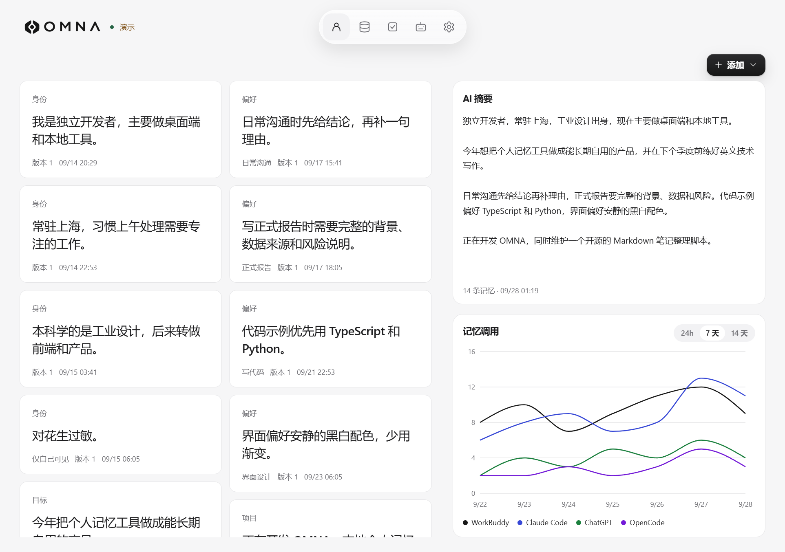
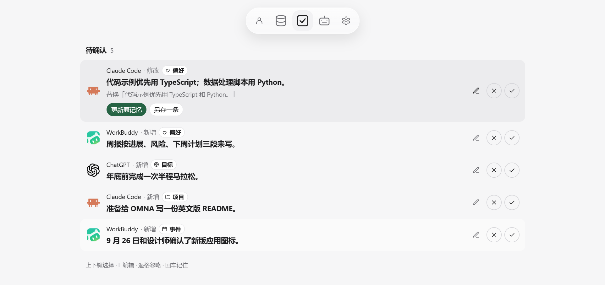
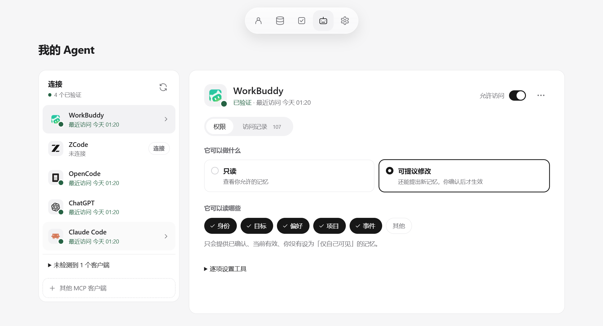
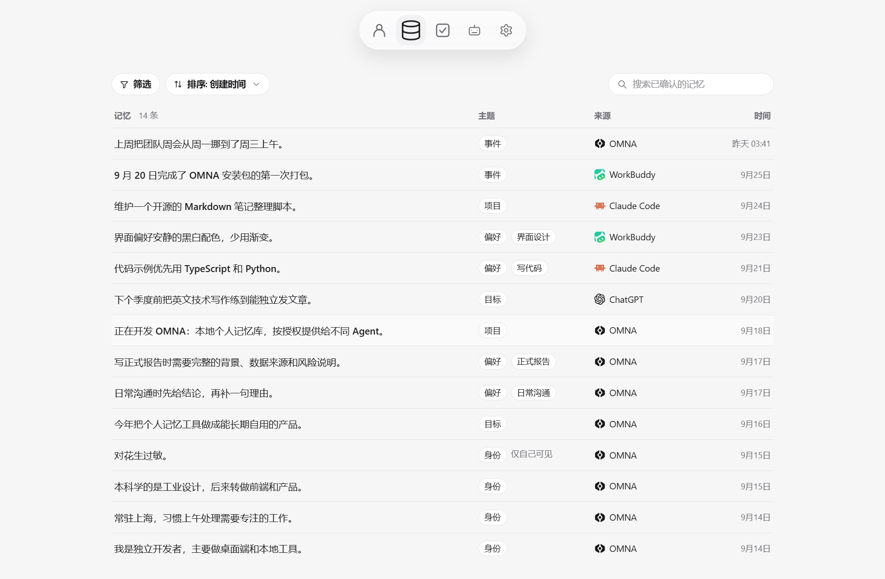
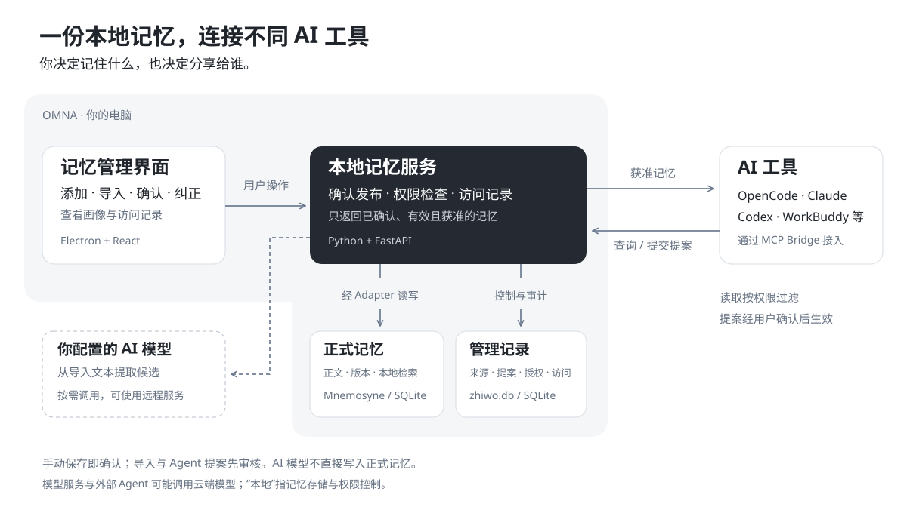

<p align="center">
  <picture>
    <source media="(prefers-color-scheme: dark)" srcset="brand/OMNA_Horizontal_White.svg">
    
  </picture>
</p>

<p align="center"><b>换一个 AI，也不用重新介绍自己。</b></p>

<p align="center">Windows 桌面应用 · 1.0.0 · 数据保存在本机</p>

<p align="center"><a href="README.md"></a> <a href="README_EN.md"></a></p>

OMNA（知我）是一款本地个人记忆工具，把你的背景、偏好和项目信息保存在一处，供不同 AI 工具按授权使用。AI 帮你整理，你决定记住什么、分享给谁，并能随时查看和纠正。

## 视频 Demo

> 演示视频制作中，完成后将在这里展示完整使用流程。

## 界面展示

<sub>以下截图使用合成演示数据。</sub>

**关于我** · 按主题查看已确认的记忆，手动生成 AI 摘要，了解各 Agent 的读取情况。



| 待确认 · 审核 AI 提出的记忆 | 我的 Agent · 管理连接与访问权限 |
| --- | --- |
|  |  |

**记忆** · 按主题、来源和状态查找记忆，查看历史版本，随时编辑或停止共享。



## 工作原理



## Agent 能用的四个工具

OMNA 对 Agent 只提供这四个 MCP 工具，没有直接修改、删除或读取原始导入文本的接口。

| 工具 | 作用 |
| --- | --- |
| `get_context` | 按当前任务取回相关且获准的记忆 |
| `search_memory` | 在获准类别内搜索当前有效的记忆 |
| `propose_memory` | 提出新增或修改建议，进入待确认，你批准后才生效 |
| `explain_memory` | 查看一条获准记忆经过审核的证据片段 |

每次调用都按连接、工具、类别、共享开关和有效期过滤。停止共享、仅自己可见、已过期、未批准或已被取代的内容，不会从任何一个工具返回。

已适配的客户端：WorkBuddy、ZCode、OpenCode、ChatGPT（Codex）、Claude 桌面版、Claude Code。其他支持 stdio MCP 的客户端，可以在「我的 Agent」里生成配置后手动粘贴。

## 本地与隐私

- 记忆、来源、待确认内容、授权和访问记录都存在本机，默认位置是 `%APPDATA%\OMNA\data`。
- 检索用的中文向量模型（bge-small-zh-v1.5）随安装包提供，在本机离线加载。
- 本地服务只监听 `127.0.0.1:8765`。访问凭证由桌面端在首次启动时随机生成，不需要手动输入。
- 没有遥测，没有云同步，没有后台采集。

有两种情况数据会离开这台电脑，OMNA 不会假装它们不存在：

1. 导入时提取候选、生成 AI 摘要，会把这一次的文本发给你在设置里配置的模型服务。不配置模型也能手动添加、查看和搜索。
2. 如果你授权的 Agent 背后是云端模型，返回给它的记忆会随它的请求离开设备。撤销授权只能阻止之后的读取，已经发出的内容收不回来。

## 安装

**系统要求：** Windows 10 / 11 x64，约 700 MB 磁盘空间。不需要另装 Python、Node.js 或其他运行库。

1. 从 [Releases](../../releases) 下载 `OMNA-Setup-1.0.0.exe`（约 210 MB）。
2. 安装包目前没有代码签名，Windows SmartScreen 可能提示「无法识别的应用」。确认来源后点「更多信息」→「仍要运行」。
3. 安装到当前用户，不需要管理员权限，可以自选目录，会创建桌面和开始菜单快捷方式。
4. 首次启动要加载本地模型，可能需要二三十秒；之后几秒内就能打开。

**日常使用：** 关闭窗口时 OMNA 会缩到系统托盘，Agent 仍然可以访问。托盘菜单里可以重新打开窗口、打开日志文件夹、重启服务或完全退出。服务日志在 `%APPDATA%\OMNA\logs\service.log`。

**卸载：** 从 Windows 设置或开始菜单卸载。卸载不会删除 `%APPDATA%\OMNA` 里的记忆数据；如果想彻底清除，先在「设置 → 清空数据」里清空，或卸载后手动删除这个文件夹。

## 连接一个 Agent

1. 打开「我的 Agent」。OMNA 会列出本机检测到的客户端。
2. 选一个客户端，点「连接」，选择「只读」或「可提议修改」。确认后 OMNA 把 MCP 配置写进该客户端的配置文件，原有配置会保留。
3. 连接后默认只能读「偏好」和「目标」两类。需要更多类别，在它的「权限」里勾选。
4. 重启客户端，把页面上给出的那句话（例如「请查一下我的偏好」）发给它。第一次调用成功后，状态会变成「已验证」。

之后在「访问记录」里能看到它每次调用了哪个工具、拿到了哪几条记忆。

## 当前版本的限制

- 只提供 Windows x64 版本，安装包未签名。
- 本地端口固定为 8765，被其他程序占用时 OMNA 会提示并停止启动，不会连到别人的服务。
- 真实客户端的端到端调用目前只在 OpenCode 上验证过；其他客户端验证了配置写入。
- 安装包在开发机上完成了安装、启动、保存、搜索、MCP 调用、重启和卸载的验收；在完全没有开发工具的新机器上安装，以及装好后完全断网运行，还没有单独验证。
- 中文检索在 20 条固定合成查询上的 Hit@5 为 19/20：直接查询 10/10，改写查询 9/10。该结果只代表这组小样本，不代表真实用户效果；检索有时会带回与任务关系不大的记忆。见[样本与查询](experiments/kernel_spike/fixtures/p0_3_queries.json)和[验证结果](experiments/kernel_spike/results/p0_3_windows.json)。

## 从源码构建

### 环境

- Windows 10 / 11 x64
- [uv](https://docs.astral.sh/uv/) 0.11 或更新（会自动安装锁定的 CPython 3.12.13）
- Node.js 24、pnpm 11.21（`corepack enable` 即可）
- 打安装包时，构建机需要 x64 Visual C++ Redistributable 14.40 或更新

### 安装依赖和模型

```powershell
pnpm install
uv sync --directory server
```

中文向量模型不在仓库里，第一次需要联网下载一次（约 90 MB）：

```powershell
uv run --directory server python -c "from fastembed import TextEmbedding; TextEmbedding('BAAI/bge-small-zh-v1.5', cache_dir=r'D:\omna-model')"
```

下载完成后，模型位于 `D:\omna-model\models--Qdrant--bge-small-zh-v1.5`。

### 开发运行

本地服务和前端分开启动。数据目录请用一个独立的新目录，不要指向正在使用的记忆库。

```powershell
$env:ZHIWO_DATA_DIR = "D:\omna-dev-data"
$env:ZHIWO_OWNER_CREDENTIAL = "dev-only-credential"
$env:ZHIWO_FASTEMBED_CACHE_DIR = "D:\omna-model"
uv run --directory server uvicorn zhiwo.api.app:app --host 127.0.0.1 --port 8765
```

另开一个终端：

```powershell
pnpm --filter @zhiwo/web dev
```

浏览器打开 `http://127.0.0.1:5173`，输入上面设置的凭证。提取模型可以在设置页里配置，也可以用 `ZHIWO_EXTRACTOR_BASE_URL`、`ZHIWO_EXTRACTOR_MODEL`、`ZHIWO_EXTRACTOR_API_KEY` 三个环境变量提供（任意 OpenAI 兼容接口）。

### 打安装包

```powershell
powershell -NoProfile -ExecutionPolicy Bypass -File apps\desktop\scripts\prepare-runtime.ps1 -ModelSource D:\omna-model\models--Qdrant--bge-small-zh-v1.5
pnpm --filter @zhiwo/desktop dist
```

`prepare-runtime` 会在 `apps/desktop/runtime/` 生成随包的 Python、锁定依赖、前端构建和模型；`dist` 输出 `apps/desktop/dist/OMNA-Setup-1.0.0.exe`。访问 GitHub 较慢时，可以先设置 `ELECTRON_MIRROR` 和 `ELECTRON_BUILDER_BINARIES_MIRROR` 指向镜像。

### 测试

测试都在临时目录里用合成数据运行，例如：

```powershell
server\.venv\Scripts\python.exe tests\test_client_connect.py
server\.venv\Scripts\python.exe tests\test_embedding_probe.py
```

涉及真实客户端的测试需要本机装好 OpenCode，可以用 `OPENCODE_BIN` 指定可执行文件。`test_p2_4_client.py` 缺少 OpenCode 时直接失败；`test_p3_2_desktop.py` 需要先打出安装包，找不到 OpenCode 时把这一项记为 `NOT_RUN`。

## 技术栈

- 桌面端：Electron 44，托管本地服务、托盘和单实例；渲染层关闭 Node 集成
- 界面：React 19、Vite、Tailwind CSS
- 本地服务：Python 3.12、FastAPI、uvicorn、MCP Python SDK
- 记忆内核：[Mnemosyne](https://pypi.org/project/mnemosyne-memory/) 3.15.1，fastembed 本地向量
- 存储：两个 SQLite。正式记忆只在 Mnemosyne 里；`zhiwo.db` 存来源、待确认、授权和访问记录

```text
apps/web        界面
apps/desktop    Electron 主进程、打包脚本和安装器配置
server/zhiwo    本地服务、MCP stdio 桥、Mnemosyne 适配层
tests           服务与验收测试，results/ 下是验收证据
experiments     早期技术验证脚本与结果
brand           标志与图标
```

## 文档

| 文档 | 内容 |
| --- | --- |
| [PRODUCT.md](PRODUCT.md) | 产品范围、页面与交互规则 |
| [ARCHITECTURE.md](ARCHITECTURE.md) | 模块边界、数据归属和接口契约 |
| [AGENTS.md](AGENTS.md) | AI 协作开发规则 |

## 许可证

本项目原创代码采用 [MIT License](LICENSE)，版权署名为 OMNA。第三方依赖、随包模型及第三方品牌素材仍适用各自的许可证或使用条款。
