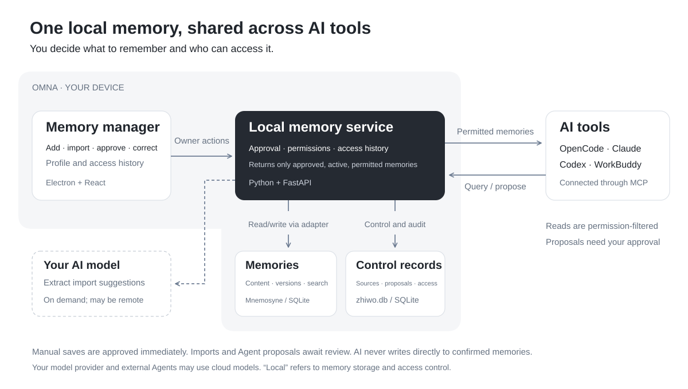

<p align="center">
  <picture>
    <source media="(prefers-color-scheme: dark)" srcset="brand/OMNA_Horizontal_White.svg">
    
  </picture>
</p>

<p align="center"><b>Switch AI tools without introducing yourself all over again.</b></p>

<p align="center">Windows desktop app · 2.0.0 · Your data stays on your device</p>

<p align="center"><a href="README.md"></a> <a href="README_EN.md"></a></p>

OMNA (知我) is a local personal memory tool. It keeps your background, preferences, and current work in one place and lets AI tools such as Claude Code, OpenCode, and ChatGPT (Codex) read it with your permission. AI tools can suggest memories, but only what you confirm is kept, and every read is recorded.

To see how it differs from existing AI memory products, read the [competitive analysis](docs/competitive-analysis.md) (Chinese).

## What's new in 2.0

1.x was a memory dashboard you opened to look at. 2.0 runs quietly in the system tray and only asks for your attention when there is a decision to make.

- **Tray icon and flyout:** the icon shows five states (normal, an Agent is reading, suggestions waiting, sharing paused, something is wrong). Left-click opens a flyout with today's reads and new suggestions, which you can accept or dismiss with ✓ / ✕ or the Y / N keys.
- **Notifications:** a regular Windows notification appears when an Agent suggests a memory. Notifications within 30 seconds are combined, clicking one opens the flyout at that suggestion, and they can be turned off in Settings.
- **Three-step onboarding:** connect the AI tools on this computer; let each one turn what its instruction file (`CLAUDE.md`, `AGENTS.md`) says about you into suggestions you tick to keep; then see what AI now knows about you.
- **Batches:** plain additions from one import or one organizing session can be kept in one click and undone as a batch. Updates, near duplicates, and suggestions without evidence are still reviewed one by one.
- **Pause sharing for an hour:** every Agent is refused until it ends, even after a restart.
- **Global shortcut:** `Ctrl Shift M` opens the main window with search focused.
- **A smaller main window:** Memories, Agents, Settings. The 1.x "About me" home page, read chart, and AI summary entry were removed.

> Screenshots are being updated for 2.0.

## How it works



## The four tools available to Agents

OMNA exposes only these four MCP tools. Agents cannot directly edit or delete memories or read original imported text.

| Tool | Purpose |
| --- | --- |
| `get_context` | Retrieve permitted memories relevant to the current task |
| `search_memory` | Search current memories within permitted categories |
| `propose_memory` | Suggest a new memory or a change; it waits for your approval |
| `explain_memory` | Show the reviewed evidence for one permitted memory |

Every call is filtered by connection, tool, category, sharing setting, and validity period. Content that is unshared, private, expired, unapproved, or superseded is not returned by any tool. While sharing is paused, all four tools refuse and the refusal is recorded.

Supported clients: WorkBuddy, ZCode, OpenCode, ChatGPT (Codex), Claude Desktop, and Claude Code. Other clients that support stdio MCP can use a configuration generated on the **Agents** page.

## Local storage and privacy

- Memories, sources, pending suggestions, permissions, and access history are stored on your device, by default in `%APPDATA%\OMNA\data`.
- The Chinese embedding model used for search (bge-small-zh-v1.5) ships with the installer and loads offline.
- The local service listens only on `127.0.0.1:8765`. The desktop app generates the access credential on first launch, so you do not need to enter it.
- No telemetry, cloud sync, or background collection.

There are three cases where data leaves your device:

1. When you import text and have configured an extraction model in Settings, that text is sent to the model service. Without one, text with headings or lists is split into suggestions by its structure, and other text is only saved as a source.
2. When you let a connected AI tool organize its instruction file, that tool reads the file and makes suggestions with its own model, so the file travels with the tool's normal requests to its model service.
3. If an Agent you authorize uses a cloud-hosted model, memories returned to it travel with that Agent's request. Revoking access prevents future reads but cannot recall content already sent.

## Installation

**Requirements:** Windows 10 / 11 x64 and about 700 MB of disk space. Python, Node.js, and other runtimes do not need to be installed separately.

1. Download `OMNA-Setup-2.0.0.exe` (about 210 MB) from [Releases](../../releases).
2. The installer is currently unsigned, so Windows SmartScreen may warn that it is an unrecognized app. If you trust the source, select **More info** → **Run anyway**.
3. Install for the current user without administrator access. You can choose the install folder; shortcuts are added to the desktop and Start menu.
4. The local model may take 20–30 seconds to load the first time. Later launches usually take a few seconds. Onboarding starts the first time OMNA opens with an empty memory library.

**Upgrading from 1.x:** install the new version over the old one. Your library stays in `%APPDATA%\OMNA`. On first launch OMNA migrates the database once (adding a separate "categories it can suggest" setting for Agents; existing connections keep their read categories), and your memories are unchanged. A library that already has data does not show onboarding. Making a backup first in **Settings → Local data** is recommended.

**While running:** closing the window minimizes OMNA to the system tray, leaving the Agent service available. Left-click the tray icon for the flyout; the right-click menu opens the main window, opens the log folder, restarts the service, or quits. The service log is at `%APPDATA%\OMNA\logs\service.log`.

**Uninstalling:** uninstall from Windows Settings or the Start menu. Your memories in `%APPDATA%\OMNA` are kept. To remove them, first use **Settings → Clear data**, or delete that folder manually after uninstalling.

## Connect an Agent

1. Open the **Agents** page (or step 1 of onboarding). OMNA lists the clients it detects on this device.
2. Choose **Connect**. OMNA adds its MCP configuration to that client's own config file and keeps existing entries. New connections are read-only and can read **Preferences** and **Goals**; change this in the Agent's **Permissions**.
3. Restart the client and send it the sentence shown in OMNA. After the first successful read, the connection is marked **Verified**.
4. If the client has an instruction file you wrote, a card offers to let it turn what the file says about you into suggestions. You tick the ones to keep and can undo them as a batch.

In **Access history**, you can see which tool each Agent called and which memories were returned.

## Current limitations

- Windows x64 only; the installer is unsigned.
- The local service uses port 8765. If another program occupies it, OMNA reports the problem and stops instead of connecting to that program.
- Full Windows acceptance for 2.0 is not finished: clean-machine install, upgrade from 1.x, uninstall leftovers, the tray icon at different scales and on light and dark taskbars, and notification delivery and clicks are still `NOT_RUN`. Native checks and code regressions done so far are in the [native check record](tests/results/desktop_native_acceptance.json) and [`tests/results/`](tests/results/).
- End-to-end calls with a real client have been verified only with OpenCode (1.x). Letting an AI tool organize its instruction file (2.0) has not yet been verified with a real client; configuration writing was checked for the other clients.
- Whether and when an Agent reads memories is up to the Agent. OMNA can show what was delivered, not whether it was used.
- Without an extraction model, structure-based splitting may file repository rules as personal information, for example putting "run pnpm build before pnpm test" under Identity. Check each suggestion before keeping it.
- Chinese retrieval achieved Hit@5 of 19/20 on 20 fixed synthetic queries (10/10 direct, 9/10 rewritten). This small sample is not a measure of real-world results; preferences unrelated to the wording of a task may not be retrieved. See the [query set](experiments/kernel_spike/fixtures/p0_3_queries.json) and [evaluation results](experiments/kernel_spike/results/p0_3_windows.json).

## Roadmap

Directions, not yet implemented: a small set of "core" memories always given to Agents, "this is outdated" suggestions, per-project memory spaces, exporting memories as text you can paste into ChatGPT or Claude memory import, and a macOS version.

## Build from source

### Requirements

- Windows 10 / 11 x64
- [uv](https://docs.astral.sh/uv/) 0.11 or later (installs the locked CPython 3.12.13 automatically)
- Node.js 24 and pnpm 11.21 (`corepack enable` is enough)
- For building the installer: x64 Visual C++ Redistributable 14.40 or later on the build machine

### Install dependencies and the model

```powershell
pnpm install
uv sync --directory server
```

The Chinese embedding model is not in the repository. Download it once (about 90 MB):

```powershell
uv run --directory server python -c "from fastembed import TextEmbedding; TextEmbedding('BAAI/bge-small-zh-v1.5', cache_dir=r'D:\omna-model')"
```

The model is then at `D:\omna-model\models--Qdrant--bge-small-zh-v1.5`.

### Run for development

Start the local service and the frontend separately. Use a new, separate data folder rather than your real memory library, and a port other than 8765 so you do not clash with an installed OMNA.

```powershell
$env:ZHIWO_DATA_DIR = "D:\omna-dev-data"
$env:ZHIWO_OWNER_CREDENTIAL = "dev-only-credential"
$env:ZHIWO_FASTEMBED_CACHE_DIR = "D:\omna-model"
uv run --directory server uvicorn zhiwo.api.app:app --host 127.0.0.1 --port 8786
```

In another terminal:

```powershell
$env:VITE_API_ORIGIN = "http://127.0.0.1:8786"
pnpm --filter @zhiwo/web dev
```

Open `http://127.0.0.1:5173` and enter the credential above. Configure an extraction model on the Settings page, or provide `ZHIWO_EXTRACTOR_BASE_URL`, `ZHIWO_EXTRACTOR_MODEL`, and `ZHIWO_EXTRACTOR_API_KEY` (any OpenAI-compatible API).

To check onboarding and **Connect**, use `tests/dev_onboarding.py`: it starts a temporary service in test mode and writes client configurations into a fake home folder, so your real AI tool settings are not touched. See the notes at the top of the script. The development desktop shell accepts `--omna-port` and `--omna-user-data`, but it uses your real home folder, so do not choose **Connect** there.

### Build the installer

```powershell
powershell -NoProfile -ExecutionPolicy Bypass -File apps\desktop\scripts\prepare-runtime.ps1 -ModelSource D:\omna-model\models--Qdrant--bge-small-zh-v1.5
pnpm --filter @zhiwo/desktop dist
```

`prepare-runtime` creates the bundled Python runtime, locked dependencies, frontend build, and model under `apps/desktop/runtime/`. `dist` outputs `apps/desktop/dist/OMNA-Setup-2.0.0.exe`. If GitHub downloads are slow, set `ELECTRON_MIRROR` and `ELECTRON_BUILDER_BINARIES_MIRROR` to your preferred mirrors.

### Tests

Tests use synthetic data in temporary folders, never touch a real memory library, and never use port 8765. Run service tests one at a time, for example:

```powershell
server\.venv\Scripts\python.exe tests\test_batches.py
server\.venv\Scripts\python.exe tests\test_sharing_pause.py
```

- `tests/test_*.py`: service and acceptance tests (`test_profile_summary.py` and `test_access_summary.py` are old pytest files and can be skipped).
- `tests/onboarding_batches.py`: runs the frontend batch logic in Node against a temporary service, covering organizing sessions, imports, keeping and undoing batches, and instruction-file ownership. Needs the `apps/web` dependencies.
- `tests/desktop_*.harness.cjs`: desktop shell code regressions (`node --test`) with Electron stand-ins; `desktop_flyout.harness.cjs` also needs Playwright installed outside the repository and a running frontend.
- `tests/onboarding_model_state.py`: how the connect-import card behaves when the extraction model setting is unknown, failing, configured, or not configured. Needs Playwright installed outside the repository.

Tests involving a real client require OpenCode on the machine; set `OPENCODE_BIN` if needed. `test_p2_4_client.py` fails without OpenCode; `test_p3_2_desktop.py` needs a built installer and records that item as `NOT_RUN` when OpenCode is missing.

## Tech stack

- Desktop: Electron 44 hosts the local service, tray, tray flyout, notifications, and global shortcut; Node integration is disabled in the renderer
- UI: React 19, Vite, Tailwind CSS
- Local service: Python 3.12, FastAPI, uvicorn, MCP Python SDK
- Memory kernel: [Mnemosyne](https://pypi.org/project/mnemosyne-memory/) 3.15.1 with local fastembed embeddings
- Storage: two SQLite databases. Confirmed memories live only in Mnemosyne; `zhiwo.db` stores sources, pending suggestions, permissions, and access history

```text
apps/web        UI (main window, tray flyout, onboarding)
apps/desktop    Electron main process, tray icons, packaging scripts, installer config
server/zhiwo    Local service, MCP stdio bridge, Mnemosyne adapter
tests           Service and acceptance tests; evidence in results/
experiments     Early technical validation scripts and results
docs            Competitive analysis, 2.0 plan, and designs
brand           Logos and icons
```

## Documentation

These documents are in Chinese.

| Document | Contents |
| --- | --- |
| [PRODUCT.md](PRODUCT.md) | Product scope, pages, and interaction rules |
| [ARCHITECTURE.md](ARCHITECTURE.md) | Module boundaries, data ownership, and interface contracts |
| [AGENTS.md](AGENTS.md) | Rules for AI-assisted development |
| [docs/v2/PLAN.md](docs/v2/PLAN.md) | 2.0 plan and acceptance criteria |
| [docs/competitive-analysis.md](docs/competitive-analysis.md) | Competitive analysis |

## License

Original code in this project is licensed under the [MIT License](LICENSE), copyright OMNA. Third-party dependencies, the bundled model, and third-party brand assets remain subject to their own licenses or terms.
