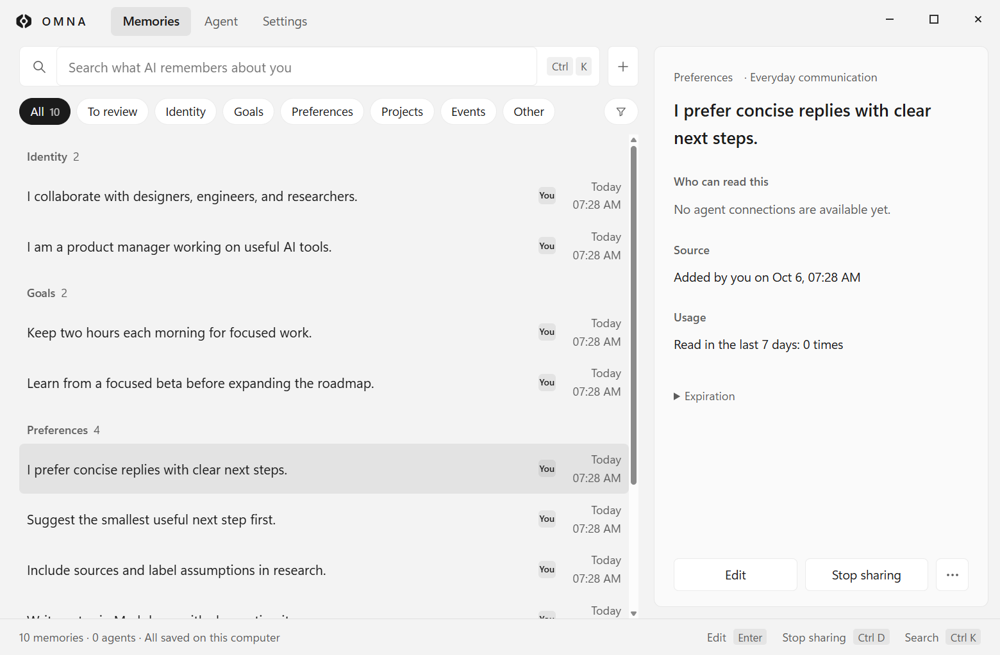
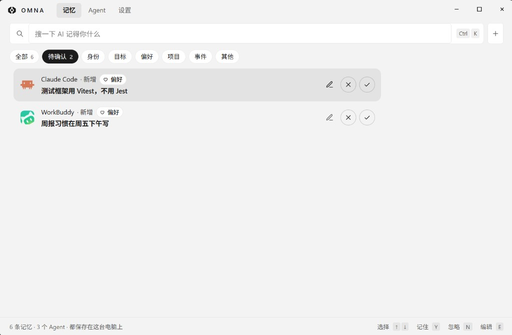
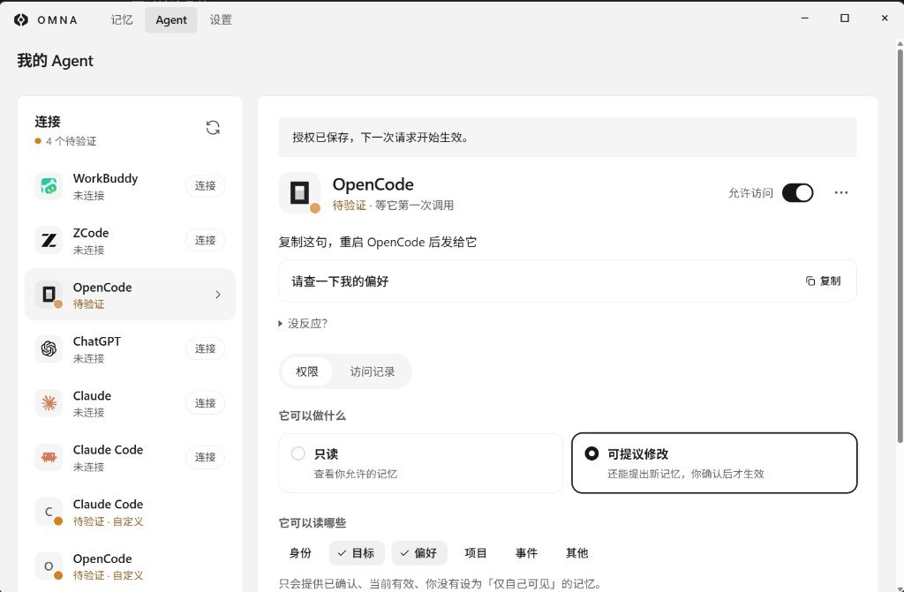
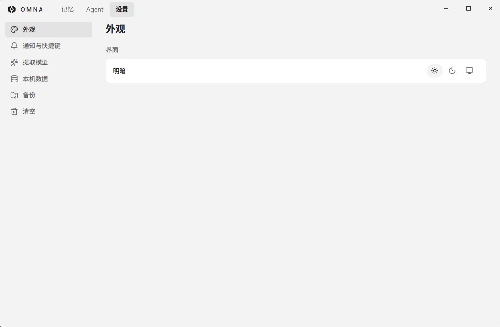

<p align="center">
  <picture>
    <source media="(prefers-color-scheme: dark)" srcset="brand/OMNA_Horizontal_White.svg">
    
  </picture>
</p>

<p align="center"><b>换一个 AI，也不用重新介绍自己。</b></p>

<p align="center">Windows 桌面应用 · 2.0.2 · 数据保存在本机</p>

<p align="center"><a href="README_ZH.md"></a> <a href="README.md"></a></p>

OMNA（知我）是一款本地个人记忆工具。它把你的背景、偏好和正在做的事保存在一处，让 Claude Code、OpenCode、ChatGPT（Codex）等 AI 工具按你的授权读取。AI 可以提建议，但只有你确认过的内容才会被记住；谁读了什么，每一次都有记录。

想了解它与现有 AI 记忆产品的区别，可阅读[竞品分析报告](docs/competitive-analysis.md)。

美国市场的推广思路与执行规划：[在线浏览 GTM 方案（PDF，23 页）](docs/gtm/OMNA_US_GTM_Strategy_v1.pdf) · [下载原始 PPT](docs/gtm/OMNA_US_GTM_Strategy_v1.pptx)。

## 界面展示

**一处管理记忆，看清谁能读到。** 搜索你的背景、目标、偏好和项目；选中一条，就能查看来源、可读取的 Agent 和近 7 天读取次数，随时编辑或停止共享。



<sub>记忆主界面来自实际 2.0.2 英文客户端，其余为 V2 中文界面。所有内容均为合成演示数据；连接状态和读取次数不代表真实使用结果。</sub>

**AI 提建议，你决定记住什么。** 「待确认」就在记忆页内，可以编辑、记住或忽略；未经确认的内容不会提供给其他 Agent。



**每个 Agent，单独授权。** 选择只读或可提议修改，分别设置读取和提议的类别；访问记录显示实际返回的记忆及交付状态。



<details>
<summary>查看设置界面：外观、通知与快捷键、可选提取模型和本机数据</summary>



</details>

## 2.0 有什么不同

1.x 是一个需要打开来看的记忆看板。2.0 改成在托盘里安静运行：平时不打扰你，只在需要你做决定时出现。

- **托盘图标与小窗**：图标显示五种状态（平时、Agent 正在读取、有建议待确认、已暂停共享、出问题了）。左键打开小窗，能看今天被读取了几次，用 ✓ / ✕ 或键盘 Y / N 处理新建议。
- **系统通知**：Agent 提出建议时弹一条普通通知，30 秒内的多条合并，点击打开小窗并定位到那一条；可以在设置里关闭。
- **3 步新手引导**：连接本机的 AI 工具；让它把自己说明文件（`CLAUDE.md`、`AGENTS.md`）里关于你的内容整理出来，你勾选后记住；最后看一眼「AI 眼中的你」。
- **按批管理**：同一次导入或同一次整理的普通新增可以勾选后一起记住。整批撤销会永久删除这批新增，需确认；已被再次修改的记忆不能直接整批撤销。修改、很像已有记忆的、过长或缺少依据的建议，仍然逐条处理。
- **暂停共享 1 小时**：所有 Agent 暂时读不到、也不能提议，到期自动恢复，重启后仍保持。
- **全局快捷键**：`Ctrl Shift M` 打开主窗口并聚焦搜索。
- **主窗口精简为三页**：记忆、Agent、设置。1.x 的「关于我」首页、读取折线图和 AI 摘要入口已去掉。

三步开始：**连接 AI 工具 → 勾选并确认它整理的建议 → 查看已确认的画像**。已有记忆库可以直接进入主窗口；日常关闭窗口后，OMNA 继续在托盘运行。

## 工作原理


## Agent 能用的四个工具

OMNA 对 Agent 只提供这四个 MCP 工具，没有直接修改、删除或读取原始导入文本的接口。

| 工具 | 作用 |
| --- | --- |
| `get_context` | 按当前任务取回相关且获准的记忆 |
| `search_memory` | 在获准类别内搜索当前有效的记忆 |
| `propose_memory` | 提出新增或修改建议，进入待确认，你批准后才生效 |
| `explain_memory` | 查看一条获准记忆经过审核的证据片段 |

每次调用都按连接、工具、类别、共享开关和有效期过滤。停止共享、仅自己可见、已过期、未批准或已被取代的内容，不会从任何一个工具返回。暂停共享期间，四个工具都会拒绝并留下记录。

已适配的客户端：WorkBuddy、ZCode、OpenCode、ChatGPT（Codex）、Claude 桌面版、Claude Code。其他支持 stdio MCP 的客户端，可以在「Agent」页生成配置后手动粘贴。

## 本地与隐私

- 记忆、来源、待确认内容、授权和访问记录都存在本机，默认位置是 `%APPDATA%\OMNA\data`。
- 检索用的中文向量模型（bge-small-zh-v1.5）随安装包提供，在本机离线加载。
- 本地服务只监听 `127.0.0.1:8765`。访问凭证由桌面端在首次启动时随机生成，不需要手动输入。
- 没有遥测，没有云同步，没有后台采集。

以下操作可能把数据发送给你选择的模型服务；使用云端模型时，相关文本会离开设备：

1. 导入文本时，如果你在设置里配置了提取模型，这一次的文本会发给那个模型服务。不配置也能用：带标题和列表的文本会按结构拆成候选，其余只保存来源。
2. 让已连接的 AI 工具整理它的说明文件时，是那个工具用它自己的模型读文件、提建议；文件内容随它平时的请求发给它的模型服务。
3. 如果你授权的 Agent 背后是云端模型，返回给它的记忆会随它的请求离开设备。撤销授权只能阻止之后的读取，已经发出的内容收不回来。

## 安装

**系统要求：** Windows 10 / 11 x64，约 700 MB 磁盘空间。不需要另装 Python、Node.js 或其他运行库。

从 [GitHub Releases](https://github.com/du24601-png/OMNA/releases/tag/v2.0.2) 下载 `OMNA-Setup-2.0.2.exe`。

1. 运行 `OMNA-Setup-2.0.2.exe`。
2. 安装包目前没有代码签名，Windows SmartScreen 可能提示「无法识别的应用」。确认来源后点「更多信息」→「仍要运行」。
3. 安装到当前用户，不需要管理员权限，可以自选目录，会创建桌面和开始菜单快捷方式。
4. 首次启动要加载本地模型，可能需要二三十秒；之后几秒内就能打开。第一次打开且记忆库为空时会进入新手引导。

**从 1.x 升级：** 先在「设置 → 备份」里保存备份。程序沿用 `%APPDATA%\OMNA` 的数据目录，按需迁移数据库；已有数据的记忆库不会再次进入新手引导。安装包覆盖升级尚未完成独立验收，见下方限制说明。

**日常使用：** 关闭窗口时 OMNA 缩到系统托盘，Agent 仍然可以访问。左键托盘图标打开小窗；右键菜单可以打开主窗口、打开日志文件夹、重启服务或完全退出。服务日志在 `%APPDATA%\OMNA\logs\service.log`。

**卸载：** 从 Windows 设置或开始菜单卸载。卸载不会删除 `%APPDATA%\OMNA` 里的记忆数据；如果想彻底清除，先在「设置 → 清空」里确认清空，或卸载后手动删除这个文件夹。

## 连接一个 Agent

1. 打开「Agent」页（或在新手引导第 1 步）。OMNA 会列出本机检测到的客户端。
2. 点「连接」。OMNA 把 MCP 配置写进该客户端自己的配置文件，原有配置会保留。默认只读，并且只能读「偏好」和「目标」；需要更多，在它的「权限」里改。
3. 重启客户端，把页面上给出的那句话发给它。第一次读取成功后，状态变成「已验证」。
4. 如果这个客户端有你写过的说明文件，页面上会出现一张卡片，可以让它把其中关于你的内容整理成建议，你勾选后记住，也能整批撤销。

之后在「访问记录」里能看到它每次调用了哪个工具、拿到了哪几条记忆。

客户端里的 MCP 服务名为 `omna`。已有 `zhiwo` 连接仍可识别；更新程序后，在「Agent」的 ⋯ 菜单选择「重新写入配置」，再重启客户端，旧入口会替换为 `omna`。自定义连接需重新复制配置，并替换客户端中的旧入口。

## 当前版本的限制

2.0.1 安装包已重新构建，包内不含用户库、演示数据或凭证；MCP 改名回归、实际安装后的桌面启动、随包模型、stdio 握手与空库搜索通过，见[安装包检查记录](tests/results/mcp_release_windows.json)。

本次源码发布的构建、托盘代码回归、暂停共享、真实内核批量确认与撤销检查均通过，见[发布检查记录](tests/results/v2_publication_checks.json)。这些检查不替代下述完整 Windows 与真实客户端验收。

- 只提供 Windows x64 版本，安装包未签名。
- 本地端口固定为 8765，被其他程序占用时 OMNA 会提示并停止启动，不会连到别人的服务。
- 2.0 的完整 Windows 验收还没有做完：干净机器安装、从 1.x 升级、卸载残留，以及托盘图标在不同缩放和深浅色任务栏下的外观、通知送达和点击，仍是 `NOT_RUN`。已做的原生检查和代码回归见[原生检查记录](tests/results/desktop_native_acceptance.json)和 [`tests/results/`](tests/results/)。
- 真实客户端的端到端调用目前只在 OpenCode 上验证过（1.x）；2.0 的「让 AI 工具整理说明文件」还没有用真实客户端验证，其他客户端验证了配置写入。
- 是否、何时读取记忆由 Agent 自己决定。OMNA 只能证明内容交给了它，不能证明它用了。
- 没有配置提取模型时，按结构拆分可能把仓库操作规则误分为个人信息，例如把「运行 pnpm test 前先 pnpm build」分到「身份」；记住之前请逐条核对。
- 中文检索在 20 条固定合成查询上的 Hit@5 为 19/20（直接查询 10/10，改写查询 9/10），只代表这组小样本。与任务字面无关的偏好可能不会被取回。见[样本与查询](experiments/kernel_spike/fixtures/p0_3_queries.json)和[验证结果](experiments/kernel_spike/results/p0_3_windows.json)。

## 从源码构建

### 环境

- Windows 10 / 11 x64
- [uv](https://docs.astral.sh/uv/) 0.11 或更新（会自动安装锁定的 CPython 3.12.13）
- Node.js 24、pnpm 11.21（`corepack enable` 即可）
- 打安装包时，构建机需要 x64 Visual C++ Redistributable 14.40 或更新

### 安装依赖和模型

```powershell
pnpm install
uv sync --directory server
```

中文向量模型不在仓库里，第一次需要联网下载一次（约 90 MB）：

```powershell
uv run --directory server python -c "from fastembed import TextEmbedding; TextEmbedding('BAAI/bge-small-zh-v1.5', cache_dir=r'D:\omna-model')"
```

下载完成后，模型位于 `D:\omna-model\models--Qdrant--bge-small-zh-v1.5`。

### 开发运行

本地服务和前端分开启动。数据目录请用一个独立的新目录，不要指向正在使用的记忆库；端口不要用 8765，以免和已安装的 OMNA 冲突。

```powershell
$env:ZHIWO_DATA_DIR = "D:\omna-dev-data"
$env:ZHIWO_OWNER_CREDENTIAL = "dev-only-credential"
$env:ZHIWO_FASTEMBED_CACHE_DIR = "D:\omna-model"
uv run --directory server uvicorn zhiwo.api.app:app --host 127.0.0.1 --port 8786
```

另开一个终端：

```powershell
$env:VITE_API_ORIGIN = "http://127.0.0.1:8786"
pnpm --filter @zhiwo/web dev
```

浏览器打开 `http://127.0.0.1:5173`，输入上面设置的凭证。提取模型可以在设置页里配置，也可以用 `ZHIWO_EXTRACTOR_BASE_URL`、`ZHIWO_EXTRACTOR_MODEL`、`ZHIWO_EXTRACTOR_API_KEY` 三个环境变量提供（任意 OpenAI 兼容接口）。

检查新手引导和「连接」时，用 `tests/dev_onboarding.py`：它以测试模式启动一个临时服务，并把客户端配置写进一个假的用户目录，不会改动你真实的 AI 工具配置。用法见脚本开头的说明。开发版桌面壳可以用 `--omna-port` 和 `--omna-user-data` 换端口和数据目录，但它使用真实用户目录，请不要在里面点「连接」。

### 打安装包

```powershell
powershell -NoProfile -ExecutionPolicy Bypass -File apps\desktop\scripts\prepare-runtime.ps1 -ModelSource D:\omna-model\models--Qdrant--bge-small-zh-v1.5
pnpm --filter @zhiwo/desktop dist
```

`prepare-runtime` 会在 `apps/desktop/runtime/` 生成随包的 Python、锁定依赖、前端构建和模型；`dist` 输出 `apps/desktop/dist/OMNA-Setup-2.0.2.exe`。访问 GitHub 较慢时，可以先设置 `ELECTRON_MIRROR` 和 `ELECTRON_BUILDER_BINARIES_MIRROR` 指向镜像。

### 测试

2.0.2 合入了 2.0.1 的 MCP 名称迁移修复，并加入默认英文与设置中英切换。语言专项 59/59、MCP 名称/配置回归 17/17、实际新版主窗口和托盘小窗 32/32 通过；77 个源文件与包内内容一致，包内未发现用户数据库、设置或凭证文件。证据见 [2.0.2 验收记录](tests/results/english-release-2.0.2/acceptance.json)。安装包未签名；本次没有在用户安装目录执行安装、升级或卸载，干净机器、系统通知与第三方模型端到端仍未验收。以下 2.0.0 的语言记录是此前实现阶段的历史证据。


客户端首次打开默认 English；在 **Settings → Appearance → Language** 中可选择 **简体中文**，切回英文的位置是 **设置 → 外观 → 语言**。主窗口、托盘小窗和原生菜单跟随选择，重启保留。记忆正文、来源、Agent 名称、已有摘要和模型输出不自动翻译；后端审核、权限、导入及模型配置保持原有行为。

2026-10-06 的 V2 语言专项：`node tests/v2_locale_ui.cjs`、`node tests/v2_locale_store.cjs`、`node tests/v2_locale_ipc.cjs`，分别通过 40/40、8/8、11/11；TypeScript 与前端构建通过。证据在 `tests/results/locale-v2/acceptance.json`，包含默认中文及产品整理指令遗漏的修复前失败。浏览器使用原始结构的合成 API 数据；IPC/preload 在隔离 VM 执行真实源码，不能替代打包后的双窗口或托盘验收。

2026-10-06 的真实 V2 打包验收：构建来自本工作树的 `v2` 分支、2.0.0 源码（基线 `2420e035` 加未提交的语言改动），77 个源文件与包内内容核对无差异。安装包为 `apps/desktop/dist/english-20261006/OMNA-Setup-2.0.0-English-20261006.exe`。实际启动 `win-unpacked/OMNA.exe`，使用隔离数据目录及真实 Python/Mnemosyne，37/37 次功能检查通过，覆盖首次英文、三栏 V2 结构、十条合成记忆、主窗口/托盘小窗双向语言同步、中文及英文重启保留、退出释放 8765。主窗口截图为 `tests/results/desktop-locale-v2/omna-v2-memories-en.png`。

证据为 `tests/results/desktop-locale-v2/build.json`、`native-acceptance.json` 及 `native-continuation.json`。额外隐藏托盘小窗截图曾超时，原始失败完整保留，未计为截图通过；真实小窗认证和同步已通过。安装包未签名；NSIS 安装/升级/卸载、干净机器、系统托盘点击/通知送达、第三方 MCP 客户端及模型请求仍是 `NOT_RUN`。


服务端与浏览器专项测试在临时目录里使用合成数据，不碰真实记忆库，不占用 8765。打包后的原生客户端固定使用 8765，验收仅在端口空闲时用隔离用户目录运行，结束后退出释放端口。服务端测试逐个运行，例如：

```powershell
server\.venv\Scripts\python.exe tests\test_batches.py
server\.venv\Scripts\python.exe tests\test_sharing_pause.py
```

- `tests/test_*.py`：服务端与验收测试（`test_profile_summary.py`、`test_access_summary.py` 是旧版 pytest 文件，可跳过）。
- `tests/onboarding_batches.py`：在 Node 里运行前端的批次逻辑，对接临时服务，覆盖整理批次、导入批次、批量记住、整批撤销和说明文件归属；需要 `apps/web` 的依赖。
- `tests/desktop_*.harness.cjs`：桌面壳的代码回归（`node --test`），用替身代替 Electron；其中 `desktop_flyout.harness.cjs` 需要仓库外的 Playwright 和运行中的前端。
- `tests/onboarding_model_state.py`：连接导入卡在提取模型配置未知、出错、已配置、未配置时的表现，需要仓库外的 Playwright。

需要真实客户端的测试要本机装好 OpenCode，可以用 `OPENCODE_BIN` 指定可执行文件。`test_p2_4_client.py` 缺少 OpenCode 时直接失败；`test_p3_2_desktop.py` 需要先打出安装包，找不到 OpenCode 时把这一项记为 `NOT_RUN`。

## 技术栈

- 桌面端：Electron 44，托管本地服务、托盘、托盘小窗、通知和全局快捷键；渲染层关闭 Node 集成
- 界面：React 19、Vite、Tailwind CSS
- 本地服务：Python 3.12、FastAPI、uvicorn、MCP Python SDK
- 记忆内核：[Mnemosyne](https://pypi.org/project/mnemosyne-memory/) 3.15.1，fastembed 本地向量
- 存储：两个 SQLite。正式记忆只在 Mnemosyne 里；`zhiwo.db` 存来源、待确认、授权和访问记录

```text
apps/web        界面（主窗口、托盘小窗、新手引导）
apps/desktop    Electron 主进程、托盘图标、打包脚本和安装器配置
server/zhiwo    本地服务、MCP stdio 桥、Mnemosyne 适配层
tests           服务与验收测试，results/ 下是验收证据
experiments     早期技术验证脚本与结果
docs            竞品分析、v2 方案与设计稿
brand           标志与图标
```

## 文档

| 文档 | 内容 |
| --- | --- |
| [PRODUCT.md](PRODUCT.md) | 产品范围、页面与交互规则 |
| [ARCHITECTURE.md](ARCHITECTURE.md) | 模块边界、数据归属和接口契约 |
| [AGENTS.md](AGENTS.md) | AI 协作开发规则 |
| [docs/v2/PLAN.md](docs/v2/PLAN.md) | 2.0 方案与验收标准 |
| [docs/competitive-analysis.md](docs/competitive-analysis.md) | 竞品分析 |

## 许可证

本项目原创代码采用 [MIT License](LICENSE)，版权署名为 OMNA。第三方依赖、随包模型及第三方品牌素材仍适用各自的许可证或使用条款。
