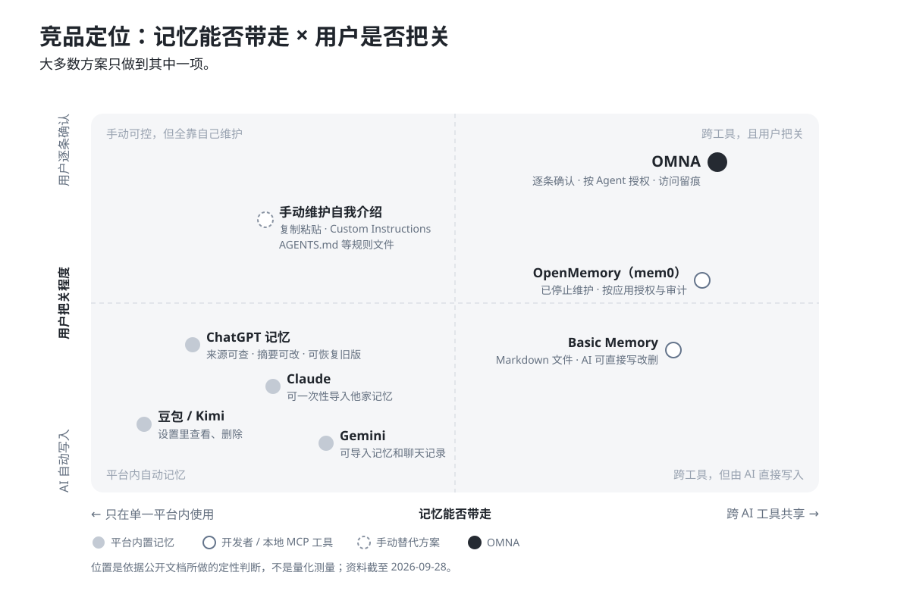
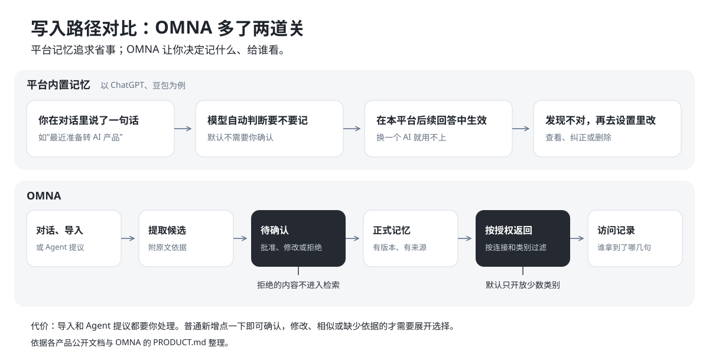

# OMNA 竞品分析

摘要

- **平台都在做记忆，但记忆只在自家有用。** ChatGPT、Claude、Gemini、豆包、Kimi 都会从对话里记住你，也都能查看和删除，可换一个工具就用不上了。2026 年 3 月前后，Claude 更新、Gemini 上线了“从其他 AI 导入记忆”，做法是让用户复制粘贴一次，把人从别家搬过来，而不是让多个工具共用一份记忆。
- **能跨工具共享的方案主要面向开发者，而且默认让 AI 直接写入。** 最接近 OMNA 的 OpenMemory（mem0 出品）同样主打本地、跨 MCP 客户端，但需要 Docker 和 OpenAI 密钥，现在已标注停止维护。
- **OMNA 选的位置是“跨工具 + 用户把关”。** 写入先审核，读取按 Agent 和类别授权，每次返回了什么都有记录。代价是多一步审核，而且目前只能接入 Windows 上支持 MCP 的客户端。

## 1. 分析框架

OMNA 面向同时使用两个以上 AI 工具的重度用户。[PRODUCT.md](../PRODUCT.md) 列出的三个用户问题，就是本文的三个比较维度：

| 用户问题               | 比较维度                                |
| ------------------ | ----------------------------------- |
| 换一个 Agent 就要重新介绍自己 | **带得走**：一份记忆能否被多个 AI 工具使用           |
| 不知道 AI 记住了什么、准不准   | **看得见、改得动**：写入前后能否查看和纠正             |
| 不知道哪个 Agent 拿到了什么  | **管得住、查得到**：能否按 Agent 限制读取，能否看到返回记录 |

另外加一个现实维度：**上手门槛**。控制做得再细，装不上也没用。

## 2. 竞品地图

按“记忆放在哪、由谁来写”，现有方案可以分成四类：

| 类型          | 代表                                     | 工作方式                         | 主要用户        |
| ----------- | -------------------------------------- | ---------------------------- | ----------- |
| 平台内置记忆      | ChatGPT、Claude、Gemini、豆包、Kimi          | 模型从对话中自动提取，存在平台云端            | 所有普通用户      |
| 开发者记忆层      | OpenMemory、Mem0 自托管服务                  | 本机或自建服务，AI 通过 MCP 或 API 读写   | 开发者、团队      |
| 本地知识库 + MCP | Basic Memory                           | 记忆就是本地 Markdown 文件，人和 AI 都能改 | 习惯记笔记的知识工作者 |
| 手动替代方案      | Custom Instructions、复制粘贴自我介绍、AGENTS.md | 用户自己写、自己贴                    | 几乎所有重度用户    |

第四类不是产品，却是 OMNA 最常面对的对手。很多人早就习惯把一段自我介绍存在备忘录里，需要时粘贴进去。OMNA 要比这个做法明显更省事，用户才会换。

横轴看记忆能不能带到别的 AI 工具，纵轴看用户对写入和读取有多少把关。左下角的平台记忆最省事；右下角的工具能跨平台，但由 AI 直接写入；左上角的手动方案完全可控，却要自己维护。在本文调研的范围内，右上角只有 OMNA。

## 3. 关键维度对比

|              | 平台内置记忆                                | OpenMemory（mem0）             | Basic Memory               | OMNA                           |
| ------------ | ------------------------------------- | ---------------------------- | -------------------------- | ------------------------------ |
| 带得走          | 只在本平台；Claude、Gemini 可一次性导入别家记忆        | 任意 MCP 客户端                   | 任意 MCP 客户端                 | 任意 stdio MCP 客户端；6 个客户端可一键写入配置 |
| 谁决定写入        | 模型自动判断，可关闭                            | Agent 调用 `add_memories` 直接写入 | AI 调用 `write_note` 等工具直接写入 | Agent 只能提议，用户批准才生效             |
| 看得见、改得动      | 可查看、删除；ChatGPT 还能看回答用了哪些记忆、改写摘要、恢复旧版本 | 控制台可浏览、添加、删除                 | 就是 Markdown 文件，任何编辑器都能改    | 每条有来源和版本，可编辑、停止共享、设有效期         |
| 按 Agent 限制读取 | 只有自家模型读取；ChatGPT 可把项目设成只用项目内记忆        | 可按应用暂停或撤销访问                  | 文档中没有看到按客户端区分可读范围          | 按连接、类别和工具授权，默认只开放少数类别          |
| 访问记录         | ChatGPT 的“来源”展示部分依据                   | 每次读写都有审计日志                   | 文档中未提及                     | 记录每次实际返回的句子和发送状态               |
| 数据在哪         | 平台云端                                  | 本机；默认用 OpenAI 做提取和向量化        | 本机 Markdown 文件 + SQLite 索引 | 本机；提取和摘要用你配置的模型                |
| 上手门槛         | 零                                     | Docker + OpenAI 密钥           | 命令行安装，编辑客户端配置文件            | Windows 安装包，一键写入客户端配置          |

OMNA 的真实客户端端到端调用目前只在 OpenCode 上验证过，其他客户端验证了配置写入。

## 4. 重点竞品

### 4.1 ChatGPT：平台记忆做得最完整的一家

ChatGPT 的记忆在 2026 年更新很密。5 月上线“记忆来源”，回答下方能看到用了哪些记忆和历史对话，不对可以直接纠正或删除。6 月起记忆逐步改为自动更新，记忆摘要也可以直接改写。更早的更新还支持查看和恢复旧版本的记忆，以及把项目设为只用项目内的记忆。

“看得见、改得动”它做得很好，但有两处和 OMNA 的目标用户对不上：

- **记忆只服务 ChatGPT 自己。** 用户在 Claude Code 或 WorkBuddy 里干活时，这些记忆帮不上忙。
- **默认先记后看。** 官方也说明，来源“不一定展示影响回答的全部因素”；删除的记忆可能要几天才会停止被引用。

**给 OMNA 的启发：** 把来源放在每条回答下面，是用户最容易理解的透明方式。OMNA 管不到 Agent 的界面，只能在自己的访问记录里展示，这是结构上的短板。另一个取舍是摘要：ChatGPT 允许直接改写摘要；OMNA 的摘要只读，纠正要回到具体某条记忆，这样摘要和记忆不会各说各话。

### 4.2 OpenMemory：方向最接近，已停止维护

2025 年 5 月，mem0 推出 OpenMemory MCP。它在本机运行，任何 MCP 客户端都能共用一份记忆，自带控制台，可以按应用暂停访问，每次读写都有审计日志。这几乎就是 OMNA 想解决的问题。

区别在三处：

- **门槛：** 需要 Docker 和 OpenAI 密钥。存储在本机，但默认用 OpenAI 的模型做提取和向量化，文本仍会发给 OpenAI。
- **写入：** Agent 调用 `add_memories` 就能直接写入，工具列表里还有清空全部记忆的 `delete_all_memories`。
- **现状：** GitHub 上的 README 已标注停止维护，建议改用面向开发者的 Mem0 自托管服务。

**它说明了什么：** 开发者确实有跨工具记忆的需求，但一个需要 Docker 的产品很难走到普通重度用户那里，mem0 最后选了开发者基础设施这条路。反过来也要警惕：这也可能说明，面向个人的跨工具记忆市场本身不够大。这一点需要用真实用户验证，不能只凭判断。

### 4.3 Basic Memory：记忆就是一堆 Markdown 文件

Basic Memory 把记忆存成本地 Markdown 文件，人和 AI 读写同一批文件，笔记之间用链接组成知识图谱，可以直接在 Obsidian 里打开。它的 MCP 工具很全，包括写、改、移动和删除笔记。

它适合用 AI 一起记笔记、做研究的人，关注的是知识，不是“关于我”的个人画像。AI 可以直接改删文件，文档里也没有看到按客户端区分可读范围的设置。

**给 OMNA 的启发：** 纯文本意味着永远带得走，这是用户愿意把数据交给一个小工具的重要理由。OMNA 已经支持导出 JSON 和 Markdown，对外介绍时应该讲得更明白。

### 4.4 国内：豆包和 Kimi

- **豆包**从对话里提取文本记忆，在“设置 - 记忆”里可以逐条删除或全部删除。官方 FAQ 特意提醒：关闭记忆不会删除已有记忆，删除聊天记录也不等于删除记忆，删除后也不是立刻停止引用。
- **Kimi**用单独训练的模型挑选值得记住的内容。用户可以一句话让它记住、更新或忘记，也能在“设置 - 个性化 - 记忆空间”里查看和删除。官方称，除非用户明确要求，它不会记住健康、密码、住址这类隐私信息。

国内用户已经在习惯“AI 会记住你”，也开始关心怎么删。但和海外平台一样，这些记忆都留在各自的 App 里。OMNA 目前接不进这些 C 端助手，只能服务支持 MCP 的桌面客户端，国内已适配的有 WorkBuddy 和 ZCode。

## 5. OMNA 的差异化和代价

| 差异点           | 用户得到什么                       | 代价                                       |
| ------------- | ---------------------------- | ---------------------------------------- |
| 写入先审核         | AI 记错的话进不了正式记忆，被拒绝的内容也检索不到   | 每条导入和 Agent 提议都要处理；普通新增一键确认，修改和相似项才要展开选择 |
| 按 Agent 和类别授权 | 例如写代码的 Agent 只读项目和偏好，读不到身份信息 | 需要配置；一键连接的客户端默认只读偏好和目标，手动创建的连接默认什么都读不到   |
| 访问记录          | 知道哪个 Agent 在什么时候拿到了哪几句       | 只能证明内容交了出去，不能证明模型用了；已发出的内容收不回来           |
| 本地存储          | 记忆库在自己电脑上，没有遥测和云同步           | 只有 Windows 版，没有手机端，多台电脑之间不同步             |

| 待确认：Agent 提出的修改，要你批准才生效     | 我的 Agent：按类别决定每个 Agent 能读什么       |
| --------------------------- | --------------------------------- |
|  |  |

截图为 1.x 界面，使用合成演示数据；2.0 的待确认和 Agent 页面布局有变化，审核和授权规则不变。

## 6. 机会、风险和下一步

**机会**

- 平台开始支持导入记忆，说明用户已经接受“记忆可以迁移”。OMNA 可以把已确认的记忆导出成适合粘贴进 ChatGPT、Claude、Gemini 导入框的文本，先当“记忆源头”，再逐步接入更多工具。这项功能尚未实现，是本文的建议。
- 支持 MCP 的桌面客户端在变多，国内的 WorkBuddy、ZCode 已经可以接入。

**风险**

- 平台可能自己做跨工具共享，或者把导入做得足够顺手，削弱 OMNA 的价值。
- 审核负担会不会让人放弃，目前没有数据。
- 普通用户不了解 MCP，接入仍有门槛。
- OpenMemory 停止维护，可能说明这个需求的规模有限。

**下一步验证**

找 5 位同时使用两个以上 AI 工具的用户试用一周，重点看三件事：

1. 每周花在审核上的时间，以及候选的通过率；
2. 打开“关于我”后，能否在 30 秒内说出系统认为自己是谁；
3. 用完第一个 Agent 后，是否愿意再授权第二个。

## 资料来源

- OpenAI：[Memory FAQ](https://help.openai.com/en/articles/8590148-memory-in-chatgpt)；[ChatGPT Release Notes](https://help.openai.com/en/articles/6825453-chatgpt-release-note)（2025-10-15、2026-05-07、2026-06-04、2026-06-26 等条目）
- Anthropic：[Import and export your memory from Claude](https://support.claude.com/en/articles/12123587-import-and-export-your-memory-from-claude)
- Google：[Import from other AI platforms to Gemini Apps](https://support.google.com/gemini/answer/16868299)；The Verge：[Google is making it easier to import another AI's memory into Gemini](https://www.theverge.com/ai-artificial-intelligence/902085/google-gemini-import-memory-chat-history)（2026-03-26）
- mem0：[Introducing OpenMemory MCP](https://mem0.ai/blog/introducing-openmemory-mcp)；[OpenMemory README](https://github.com/mem0ai/mem0/blob/0fbbb2f5/openmemory/README.md)（含停止维护说明）；[Mem0 Self-Hosted Server](https://github.com/mem0ai/mem0/tree/main/server)
- Basic Memory：[README](https://github.com/basicmachines-co/basic-memory/blob/main/README.md)；[Quickstart: Local](https://docs.basicmemory.com/start-here/quickstart-local)
- 豆包：[记忆功能 FAQ](https://www.doubao.com/legal/memory_faq)
- Kimi：[Memory space](https://www.kimi.com/help/features/memory-space)
- OMNA：[PRODUCT.md](../PRODUCT.md)、[README.md](../README.md)，以及 `tests/results/` 下的验收记录
