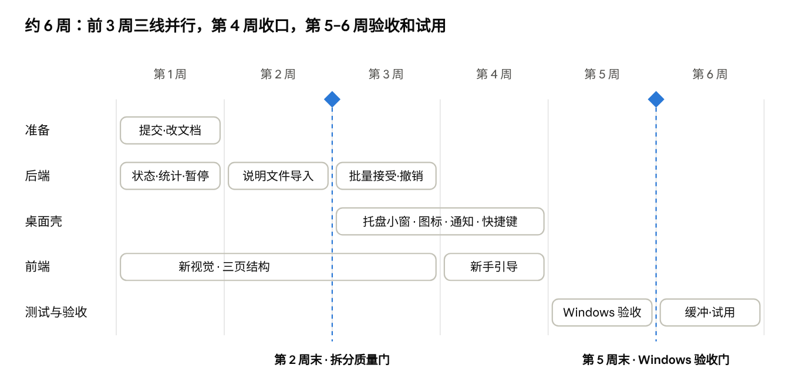

# OMNA v2 方案

2026-10-02 · 在线版：https://claude.ai/code/artifact/8f595b49-eb3f-40d2-8779-37052fe8e7eb（以在线版为准；本文件是导出副本，供编程 Agent 读取）

## 概览

v2 把 OMNA 从「打开来看的记忆看板」改成「在托盘里安静运行的后台工具」：日常只在需要你做决定时出现，用户按批管理记忆，而不是逐条阅读。预计 4–6 周（22–31 个工作日），前后端工作量大约各占一半。

- **形态：** 托盘图标 + 托盘小窗 + 普通系统通知 + 精简主窗口（记忆、Agent、设置三页）+ 4 屏新手引导。
- **去掉：** 「关于我」首页、读取次数折线图、AI 摘要入口。
- **新增：** 托盘五种状态、暂停共享 1 小时、每条记忆的读取次数、从 `CLAUDE.md` / `AGENTS.md` 导入、批量接受新增与整批撤销、连接新 Agent 时提示导入、Agent 回复里带来源行。
- **不做（技术难度大）：** 通知里直接点按钮、语义冲突识别、整批撤销中的修改回滚、实时推送通道（改用轮询）。
- **交互设计稿：** 在线画布 https://claude.ai/artifact/3FhiBQHt491RLncHgtF66H 的「后台形态」页；本仓库 `docs/v2/design/` 下有源码和截图，清单见文末附录。

## 背景与依据

**项目现状。** V1 核心闭环（导入 → 待确认 → 连接 Agent → 读取与提议 → 访问记录）已在原生 Windows 上跑通。「用已有 Agent 做提取」的 P0 改动和 D1–D4 修复已通过复测，OpenCode + deepseek 提交成功率 100%，但尚未提交 Git。安装包未签名，干净机器安装和断网运行未测。

**用户洞察。**

- 产品在电脑里长期后台运行，价值发生在别的工具里：Agent 读到偏好，回答更合你意。
- 人不会反复阅读关于自己的档案，也懒得逐条看记忆内容；真正关心的是导入导出、整体管理，以及读取和修改发生时的即时反馈。
- 竞品（ChatGPT、Claude、Kimi）都把记忆放在设置或管理页，没有一家做成首页。

**参考产品与借鉴点。**

| 参考 | 借鉴什么 | 落在 OMNA 的哪里 |
| --- | --- | --- |
| [Wispr Flow](https://wisprflow.ai/post/designing-a-natural-and-useful-voice-interface) | 存在感越小越好，只留常驻小提示 | 托盘图标是产品的「脸」 |
| [Apple 隐私指示灯](https://support.apple.com/HT211876) | 有 App 在用摄像头时亮一个点 | Agent 读取时托盘亮一下 |
| [Little Snitch](https://help.obdev.at/littlesnitch4/alert-overview) | 用的时候再问，技术细节默认收起 | 连接新 Agent 时提示导入 |
| [Superhuman](https://blog.superhuman.com/gmail-vs-superhuman/) | 100 毫秒内反馈，纯键盘处理 | 待确认的 Y / N / ↑↓ |
| [Raycast](https://www.raycast.com/blog/a-fresh-look-and-feel) | 紧凑窗口、搜索优先、底部操作栏 | 主窗口的搜索框与快捷键栏 |
| [Granola](https://overtheanthill.substack.com/p/granola) | 区分「你写的」和「AI 补的」 | 每条记忆标出来源（你 / Agent） |
| [Windows 应用通知](https://learn.microsoft.com/en-us/windows/apps/develop/notifications/app-notifications/app-notifications-content) | 通知的样式与限制 | v2.0 只做普通通知，按钮留给以后 |

## 设计原则

每个界面只回答一个问题：用户此刻需要做什么决定。

1. **默认安静。** 没事不弹窗、不显示数字角标，托盘图标和系统图标一样单色。
2. **按批管理，不按条阅读。** 导入给汇总、新增一键记住、整批可撤销；只有修改和相似项才逐条看。
3. **在发生的地方反馈。** 读取时托盘亮一下，Agent 的回复里带一行来源，确认后告诉用户「哪些 Agent 下次会用到」。
4. **100 毫秒内有反应。** 点下去界面先变，后台再保存；失败保留输入并可重试。
5. **能用键盘就不用鼠标。** 全局快捷键呼出主窗口，待确认用 Y / N / ↑↓，搜索用 Ctrl K。
6. **跟随系统。** 按 Windows 11 的字体、材质、圆角和通知样式来；品牌绿只用在状态、「记住」和读取提示。
7. **信任两步可及。** 「谁读了什么」「谁能读到这条」在两次点击内能看到；不审核不生效的原则不变。

## 产品形态

用户日常只接触托盘图标、托盘小窗和通知；主窗口只在管理记忆或 Agent 时打开，新手引导只在第一次出现。

### 托盘图标（5 种状态）

| 状态 | 样子 | 悬停提示 |
| --- | --- | --- |
| 平时 | 单色圆环 + 中心点 | OMNA 运行中 |
| 有 Agent 在读取 | 中心点变绿，呼吸约 2 秒 | 「Claude Code 正在读取 · 偏好 2 · 项目 1」 |
| 有待确认 | 右上角一个小绿点，不显示数字 | 「3 条建议等你确认」 |
| 已暂停共享 | 外圈断开，中心变成暂停 | 「已暂停共享 · 59 分钟后恢复」 |
| 出问题了 | 图标变淡 + 琥珀色角标 | 「本机服务没在运行 · 点击查看原因」 |

左键打开托盘小窗，右键保留现有菜单（打开窗口、日志、重启服务、退出）。

### 托盘小窗（约 368 × 520）

- 顶部：运行状态；「暂停共享 1 小时」和「打开主窗口」两个图标按钮。
- 价值回执：「今天被读取 12 次」及各 Agent 次数；暂停时换成琥珀色提示。
- 待确认：新增类直接 ✓ / ✕，修改类只给「看差异」；支持 ↑↓ / Y / N。
- 最近：最近 2 次读取，只显示类别和次数，不显示句子。
- 底部：「打开 OMNA」和快捷键 Ctrl Shift M、设置。点小窗外任意处自动收起。

### 系统通知（普通通知）

- Agent 提出建议时弹一条，写明是哪个 Agent、新增还是修改、内容和依据。
- 点击通知打开托盘小窗并定位到这条；v2.0 通知里没有按钮。
- 30 秒内的多条合并成一条；设置里可以关掉通知。

### 主窗口（默认 1040 × 680，最小 960 宽）

- 三页：**记忆**（默认）、**Agent**、**设置**。关闭即收进托盘。
- 记忆页：顶部搜索框（Ctrl K）；筛选「全部 / 待确认 / 现在在忙 / 合作方式 / 长期 / 生活」；列表每行标来源（你 / Agent 缩写）和时间；右侧详情写明谁能读到、来源与证据原文、近 7 天被读取次数；底部是快捷键栏。右上「＋」里是添加和导入。
- Agent 页：连接列表 + 详情（权限、访问记录）；刚连接的客户端如果有说明文件，在详情里出现导入卡片。
- 设置：外观、提取模型（可选）、通知、本机数据（导出、备份、恢复、清空）。

### 新手引导（第一次打开，4 屏）

1. **连接**：勾选本机检测到的客户端，一次连多个；写过说明文件的标「有你写过的说明」。
2. **带上已有的**：勾选找到的 `CLAUDE.md` / `AGENTS.md`；或复制一句话到 ChatGPT、Kimi、豆包，把回答粘回来；或拖入文件。可跳过。
3. **批量确认**：汇总「新增 N · 重复已合并 M · 很像的要你选 K」；新增默认全选，取消勾选即不记；很像的两条选一条或都留。
4. **AI 眼中的你**：由已确认记忆拼出的画像卡（不调模型），写明哪些 Agent 能读到哪几类；给一句去 Agent 里试的话；「完成，收进托盘」。

## v2.0 功能范围

只砍技术难度大、不确定性高的部分，其余功能全部保留。

### 做

| 功能 | 涉及 | 估算（工作日） |
| --- | --- | --- |
| 新视觉（跟随 Windows 11）+ 三页结构，去掉关于我 / 折线图 / 摘要入口 | 前端 | 3–4 |
| 记忆页：搜索、分区筛选、合并待确认、详情（谁能读到、证据、读取次数）、快捷键栏 | 前端 | 2–3 |
| Agent 页重排 + 设置精简 | 前端 | 1 |
| 新手引导 4 屏 | 前端 | 1.5–2 |
| 托盘小窗（第二个窗口、贴托盘定位、失焦收起、系统材质） | 桌面壳 + 前端 | 2–3 |
| 托盘图标 5 种状态，靠轮询驱动 | 桌面壳 + 后端 | 1–1.5 |
| 全局快捷键、窗口尺寸 | 桌面壳 | 0.5 |
| 普通系统通知（点击打开小窗、合并、可关闭） | 桌面壳 | 0.5–1 |
| 每条记忆的读取统计、给托盘用的状态接口 | 后端 | 1–1.5 |
| 暂停共享 1 小时（全局开关 + 定时恢复 + 四个工具拦截 + 审计） | 后端 | 1.5–2.5 |
| 发现说明文件、按结构拆分、去重与相似标记 | 后端 | 2–3 |
| 批量接受新增、整批撤销（删除这批新增） | 前端 + 后端 | 1–2 |
| 连接新 Agent 时提示导入 | 前端 | 0.5 |
| Agent 回复里带「已参考你的偏好」一行 | MCP 说明 | 0.5 |
| 测试与 Windows 验收 | 全部 | 3–4 |
| 更新 PRODUCT / ARCHITECTURE / AGENTS / README | 文档 | 1 |
| **合计** |  | **约 22–31（4–6 周）** |

### 不做（技术难度大）

| 不做 | 原因 | 替代做法 |
| --- | --- | --- |
| 通知里直接点「记住 / 忽略」 | 要自写 Windows 通知模板 + `omna://` 协议唤起 + 单实例转发，需技术验证 | 点击通知打开小窗处理，多点一下 |
| 语义冲突识别 | 没有模型无法可靠判断 | 文字一致的自动合并；向量相似的标「很像」交给用户 |
| 整批撤销里的修改回滚 | 跨两个数据库回滚版本，一致性难保证 | 批量接受只针对新增；修改照旧逐条确认 |
| 实时推送通道 | 要新建服务到桌面壳的长连接 | 桌面壳每 3–5 秒轮询，效果相同 |

### 延后到 v2.1 或以后

- 通知里的操作按钮（先做技术验证）。
- 「最近改动」列表与单条撤销。
- 交给已连接的 Agent 整理导入（测试报告里的 P1，需放开「只有四个工具」）。
- 按目的地导出（粘贴进 ChatGPT / Claude / Gemini 的版本）、自动备份、跨版本恢复。
- 自动整理建议、每周摘要通知、「没找到」变成补充提示。

## 基线变更

开工前先把下面这些改进三份文档，编程 Agent 才不会因为「违反基线」停下来。

| 文档 | 现在的写法 | v2 改为 |
| --- | --- | --- |
| PRODUCT.md §2 核心闭环 | 首页按身份、目标、偏好、项目展示「AI 眼中的我」 | 新手引导结束时展示一次；日常入口是托盘小窗 |
| PRODUCT.md §3 候选审核 | 普通新增在列表里逐条确认 | 同一批导入的新增可一键记住，整批可撤销；修改、相似、过长、缺少依据仍逐条处理 |
| PRODUCT.md §3 添加与导入 | 粘贴、TXT / Markdown | 增加：用户点击后只读一次固定路径的 `CLAUDE.md` / `AGENTS.md`；没配模型时按 Markdown 结构拆分 |
| PRODUCT.md §5 页面与交互 | 五个导航，默认关于我，窗口最小 1024 px | 记忆 / Agent / 设置三页，默认记忆，最小 960 px；新增托盘小窗、托盘状态、通知、全局快捷键 |
| PRODUCT.md §5.1 视觉约定 | 带液态玻璃的浮动导航、关于我卡片墙 | 跟随 Windows 11：系统字体、系统材质、8 px 圆角；品牌绿只用于状态、「记住」和读取提示 |
| PRODUCT.md §4 共享 | 停用单个 Agent、停止共享单条 | 增加「暂停共享 1 小时」：期间所有 Agent 的四个工具都拒绝并记录 |
| PRODUCT.md §3 关于我 | 手动生成 / 更新 AI 摘要 | 从界面上去掉；接口先保留不删 |
| AGENTS.md §2 基线 | Agent 只有四个 MCP 工具 | 不变；MCP 说明里增加「回复时带一行来源」「提议后告诉用户等确认」 |
| ARCHITECTURE.md §2 运行结构 | Electron 只管主窗口和托盘菜单 | 增加托盘小窗窗口、状态轮询、通知、全局快捷键 |
| ARCHITECTURE.md §6.1 Owner API | 现有 42 个接口 | 增加下一节列出的接口 |
| README.md 限制说明 | 只在 OpenCode 上端到端验证 | 按 v2 验收结果更新 |

## 技术方案

不动数据库结构（仍是 schema 8），不动发布和删除的核心逻辑；新增状态都放在现有 `settings` 表和 `payload_json` 里。

### 后端（server/zhiwo）

| 改动 | 接口 / 位置 | 要点 |
| --- | --- | --- |
| 托盘状态 | 新增 `GET /api/v1/status` | 返回待确认数、暂停到期时间、服务是否正常、最近一次成功读取（Agent、类别、时间）；桌面壳每 3–5 秒调一次 |
| 今天被读取次数 | 复用 `access.read_counts` | 按本地日期汇总各 Agent 次数 |
| 每条记忆近 7 天读取次数 | `GET /api/v1/memories` 加 `reads_7d` | 从 `access_events.response_snapshot` 解出返回的记忆 id 计数；只统计已发出的 |
| 暂停共享 | 新增 `POST` / `DELETE /api/v1/sharing/pause` | `settings.sharing_paused_until`；`agent_tools` 鉴权后第一步检查，拒绝码 `SHARING_PAUSED`，写一条 rejected 访问记录；到期自动失效（读时判断，不开定时器） |
| 发现说明文件 | 新增 `GET /api/v1/agent-files` | 只查白名单路径（如 `%USERPROFILE%\.claude\CLAUDE.md`、`.codex\AGENTS.md`、`.config\opencode\AGENTS.md`，各客户端实际路径开工时逐一核实）；返回客户端、路径、大小、是否导入过；不读内容 |
| 从说明文件导入 | `POST /api/v1/imports` 增加 `agent_file` | 服务端自己读白名单文件（≤ 1 MiB），来源类型用现有的 `file`，名字记路径 |
| 按结构拆分 | `imports._run_extraction` | 没配模型时改走拆分器：列表项 / 每行一条为候选，标题关键词定类别（偏好、项目、目标…），证据 = 原行；任务状态记 `extracted`。配了模型仍走原来的提取 |
| 去重与相似标记 | 同上 | 规整空格和全半角标点后文字相同的，合并并记 `dup_of`；与已有记忆或同批候选向量相似的，记 `similar_to`（复用审核里现有的相似判断） |
| 批量接受新增 | 新增 `POST /api/v1/imports/{job_id}/accept-additions` | 只处理该批次里未标相似、未排除的新增；逐条调用现有 `decide_proposal`（本身幂等），返回每条结果，失败的保留在待确认 |
| 整批撤销 | 新增 `POST /api/v1/imports/{job_id}/undo` | 把这批通过新增发布的记忆走现有永久删除流程；只在这些记忆没被再次修改过时允许，否则拒绝并说明 |
| 新提议列表 | `GET /api/v1/proposals` 加 `since` | 给桌面壳决定要不要弹通知 |

### MCP（gateway/stdio_bridge.py）

- 工具仍是四个，不加工具。
- `_INSTRUCTIONS` 加两条：用到记忆时在回复末尾带一行「已参考你在 OMNA 的…」；提议后告诉用户「已提议，等你在 OMNA 里确认」。
- 暂停共享时返回的错误文案写明「用户暂停了共享」，让 Agent 如实告诉用户。

### 桌面壳（apps/desktop/src/main.cjs、preload.cjs）

- **托盘小窗**：第二个无边框 `BrowserWindow`（368 × 520，`skipTaskbar`、失焦隐藏），按 `tray.getBounds()` 贴托盘定位，加载同源页面的 `#/flyout`；Windows 11 上尝试系统材质，不支持时退回普通背景。
- **托盘图标**：5 套图标（含浅色 / 深色任务栏两个版本）；main 进程用本机凭证轮询 `/api/v1/status` 切换；左键开小窗，右键菜单不变。
- **通知**：Electron `Notification`；出现新提议时弹，30 秒内合并；点击打开小窗并定位；受设置开关控制。
- **全局快捷键**：`globalShortcut` 注册 Ctrl Shift M，打开主窗口并聚焦搜索框；被占用时在设置里提示。
- **主窗口**：默认 1040 × 680，最小 960 × 600；关闭仍收进托盘。
- preload 只加必要的事件（打开小窗、定位到某条建议），渲染层仍关闭 Node 集成。

### 前端（apps/web/src）

- 删除：关于我页（`App.tsx` 对应部分）、`Trend.tsx`、摘要入口。
- 新页面 / 视图：`#/memories`（默认）、`#/agents`、`#/settings`、`#/flyout`、`#/onboarding`。
- `Review.tsx` 的审核逻辑搬进记忆页的「待确认」筛选和小窗；修改类的差异视图保留。
- `styles.css` 按新的颜色变量重写，浅色 / 深色一套变量；字体用系统字体。
- 「谁能读到」在前端用 Agent 权限 + 记忆的类别、共享、有效期算出；以服务端过滤为准，前端只是展示。
- 键盘：小窗和待确认列表内 ↑↓ / Y / N，仅在列表有焦点时生效。

## 排期与任务拆分

按一人加 AI 编程工具的节奏约 6 周，其中第 6 周是缓冲和封闭试用。前 3 周后端、桌面壳、前端并行，互不阻塞；所有测试随做随加，第 5 周集中在 Windows 上验收。

| 周 | 准备 | 后端 | 桌面壳 | 前端 | 测试与验收 |
| --- | --- | --- | --- | --- | --- |
| 第 1 周 | 提交 P0、改基线文档 | 状态接口、读取统计、暂停共享 |  | 新视觉、三页结构 |  |
| 第 2 周 |  | 说明文件导入（发现、拆分、去重） |  | 新视觉、三页结构 |  |
| 第 3 周 |  | 批量接受、整批撤销 | 托盘小窗、图标、通知、快捷键 | 新视觉、三页结构 |  |
| 第 4 周 |  |  | 托盘小窗、图标、通知、快捷键 | 新手引导 |  |
| 第 5 周 |  |  |  |  | Windows 验收 |
| 第 6 周 |  |  |  |  | 缓冲、封闭试用 |

两道关卡决定后面怎么走：

1. **第 2 周末 · 拆分质量门**：用 5–10 份合成说明文件测，分类正确率 ≥ 80%、用户需要手动改的条数 ≤ 20%。不达标就把「交给 Agent 整理」提前到 v2.0，导入部分延长约 1 周。
2. **第 5 周末 · Windows 验收门**：「验收标准」一节全部通过。不达标就用第 6 周修复，封闭试用顺延。

开工前的准备（1–2 天，含在第 1 周）：

- [ ] 提交 P0 和 D1–D4，打标签 `v1.1`，新建 `v2` 分支。
- [ ] 按「基线变更」一节改 PRODUCT / ARCHITECTURE / AGENTS。
- [ ] 核实各客户端说明文件的实际路径，写进白名单。
- [ ] 准备 5–10 份合成说明文件，作为拆分质量门的测试集。

## 验收标准

全部在原生 Windows 11 上、用合成数据验收；缺条件的记 `NOT_RUN`，不算通过。

**新手与导入**

- [ ] 干净机器上安装后，没配模型，从引导第 1 步到「完成」不超过 3 分钟。
- [ ] 用一份 30 行的合成 `CLAUDE.md`：拆出的候选条数与列表项数一致，证据逐字匹配 100%，文字相同的重复 100% 被合并。
- [ ] 「记住 N 条」后记忆库恰好多 N 条；「撤销这次导入」后恢复原样，任何工具都读不到这些内容。
- [ ] 白名单以外的路径一律拒绝；导入不改动原文件（修改时间不变）。

**托盘、小窗、通知**

- [ ] Agent 读取后 5 秒内托盘变绿；Agent 提议后 5 秒内出现小绿点和通知。
- [ ] 点击通知打开小窗并定位到这条；在小窗里全程用键盘处理完 3 条。
- [ ] 小窗打开到可操作 ≤ 300 毫秒；点 ✓ 后界面 100 毫秒内变化。
- [ ] 服务停止时图标变成「出问题了」，点击能看到原因和日志位置。

**暂停共享**

- [ ] 暂停期间四个工具对所有连接都返回拒绝，访问记录里都有 rejected 事件；到期或手动恢复后立即正常。
- [ ] 重启服务后暂停状态保持。

**回归**

- [ ] 现有 P1–P3、P0 回归、T01–T10 全部通过。
- [ ] OpenCode + 国产模型、Claude Code 各跑 3 次真实提取，达到原有门槛；回复里出现来源行的比例 ≥ 80%。
- [ ] 安装、升级、卸载后用户数据保留；全局快捷键、托盘、通知在卸载后都不残留。

## 风险与应对

最大的风险是「按结构拆分」的质量：它决定了第一次使用时用户看到的画像像不像自己。

| 风险 | 可能的后果 | 应对 |
| --- | --- | --- |
| 按结构拆分分类粗糙 | 很多条落进「其他」，句子是编程说明的口吻 | 用 5–10 份真实风格的合成说明文件调关键词表；配了模型的用户走原来的提取；v2.1 加「交给 Agent 整理」 |
| 各客户端说明文件路径不一致或会变 | 找不到文件，引导第 2 步是空的 | 路径做成可配置的白名单；找不到时突出「从其他 AI 搬家」和拖入文件 |
| 托盘小窗在多显示器、任务栏不在底部、缩放比例不同时位置不对 | 小窗出现在屏幕外或盖住任务栏 | 按工作区边界修正位置；验收包含 100% / 150% 缩放和两块屏 |
| 系统材质在部分 Windows 版本上不生效或闪烁 | 小窗看起来很廉价 | 检测不到 Windows 11 就用普通背景，设计上两种都要好看 |
| 轮询带来的耗电和日志噪音 | 笔记本续航、日志变大 | 小窗和主窗口都不可见时降到 10 秒一次；状态接口不写通用日志 |
| 通知太多被用户关掉 | 建议堆积无人处理 | 30 秒合并；依赖 Agent 自己在回复里说「等你确认」；托盘小绿点始终保留 |
| 全局快捷键被其他软件占用 | 快捷键不生效 | 注册失败时在设置里提示并允许改键 |
| 整批撤销是永久删除 | 用户误点后反悔 | 二次确认并写明条数；只允许撤销没被再次修改过的批次 |
| P0 改动和 D1–D4 还未提交 | v2 改动混在一起，出问题难以回退 | 开工前先提交并打标签 `v1.1`，v2 在单独分支开发 |

## 附：交互设计稿

设计稿源码和截图在本目录 `design/` 下，说明见 `design/README.md`。在线画布（可点击操作）：https://claude.ai/artifact/3FhiBQHt491RLncHgtF66H 的「后台形态」页。数据均为虚构人物「林屿」的模拟数据。

| 画板 | 截图 | 可以试什么 | 对应章节 |
| --- | --- | --- | --- |
| 托盘小窗 | `design/screenshots/Flyout.png` | 点 ✓ / ✕ 处理新增；修改只给「看差异」；点右上角暂停按钮切换「暂停共享」状态 | 产品形态 · 托盘小窗 |
| 系统通知 | `design/screenshots/Toast.png` | 普通通知的样子：Agent 在终端里说「已提议」，右下角弹出新增和修改两条通知，托盘图标带小绿点 | 产品形态 · 系统通知 |
| 主窗口 · 记忆 | `design/screenshots/Window.png` | 搜索框输入筛选；切换筛选标签；点一行看详情；在「待确认」里看修改的前后对比 | 产品形态 · 主窗口 |
| 托盘图标 · 五种状态 | `design/screenshots/Tray.png` | 放大 2 倍的 5 种状态及悬停提示 | 产品形态 · 托盘图标 |
| 引导 1 · 连接 | `design/screenshots/Onboarding.png` | 勾选客户端、一路点到第 4 步 | 产品形态 · 新手引导 |
| 引导 2 · 带上已有的 | `design/screenshots/Onb2.png` | 勾选说明文件；展开「从 ChatGPT、Kimi、豆包搬过来」 | 同上 |
| 引导 3 · 批量确认 | `design/screenshots/Onb3.png` | 取消勾选任一条；对「很像」的两条选一条或都留，按钮条数跟着变 | 同上 |
| 引导 4 · AI 眼中的你 | `design/screenshots/Onb4.png` | 画像卡、谁能读到哪几类、去 Agent 里试的一句话 | 同上 |
| 连接新 Agent 时提示导入 | `design/screenshots/ConnectImport.png` | 连上 Codex 后的导入卡片：「导入 5 条」、「不用了」、「撤销这次导入」 | 产品形态 · 主窗口 |
